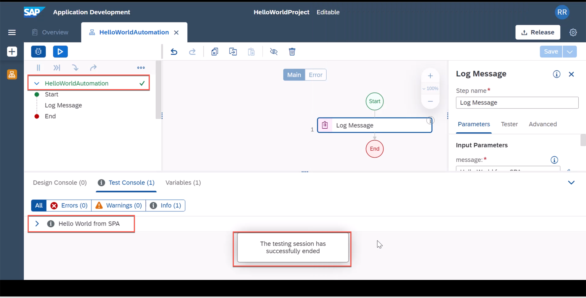

Instructions | Image
------------ | -----
A1. Launch **SAP Process Automation** from your sub account | 
A2. Select **Create an Automation** from within SAP Process Automation Lobby | 
A3. Enter the below details 1) Your Project Title 2) Your Project Description and click Create button | 
A4. If your agent is not registered, It will return an error that agent is not registered. You can click close. | 
A5. Get your tenant URL. First Navigate from SPA Lobby to **Settings** | 
A6. From the Agents Menu Option (1), Select **Register new Agent button** (2) and select "Copy and Close" button to get the tenant URL | 
A7. Click Windows Icon and search for an app **Desktop Agent** (1) and Launch the app if it is not already running | 
A8. From the System tray, locate a grey coloured globe looking icon | 
A9. Click the triple dot (**...**) (1) menu and click **Tenants** option (2) | 
A10. Enter the copied URL under Domain and give a unique name for this SPA tenant that you can remember | 
A11. Once you click Save, it will pop up a message Validation in Progress | 
A12. Depending on your Account setup, you will need to authenticate with a certificate based authentication or you will need to enter user credential until it prints a message "Login Successful" | 
A13. Make sure you activate the newly added tenant from the tenant menu of Desktop Agent again. | 
A14. You can validate this by visiting your Settings Menu and refresh the registered Agent list.  | 
A15. After Refresh it should appear in the list of agents. This concludes Agent registration with SAP Process Automation | 
A15. We will switch to your project screen in the browser, select the most recent agent version | 

> It is always recommended to install and use latest version of SAP Process Automation Desktop Agent. 

Instructions | Image
------------ | -----
A16. Enter a Project Name | 
A17. Initially it will add dependent projects like CORE SDK, Excel SDK to the project | 
A18. Search an activity by Name **Log Message** (1), and locate it in the result (2) | 
A19. Drag and drop the **Log Message** Activity in the flow chart between stard and End | 
A20. Select the newly added activity (1) , enter any string say **Hello World from SPA** in the Message field (2) , Select the suggested string value (3) Save the project (4) | 
A21. Now we are ready to test the project, click the play or run button (1) | 
A22. Click **Test** from the Test Automation Dialog | 
A23. You should see Success Message in all the highlighted sections | 

**END**