### Pre-requisites
 
1. SAP Process Automation service is setup in your SAP BTP Subaccount
2. User running the automations have required roles
3. You have access to a Windows System and all the required on-premise components are installed in that windows system
4. Microsoft Office (Outlook, Excel) is installed in that windows system, with at least one mailbox configured

Instructions | Image
------------ | -----
B1.  Click the wheel icon | 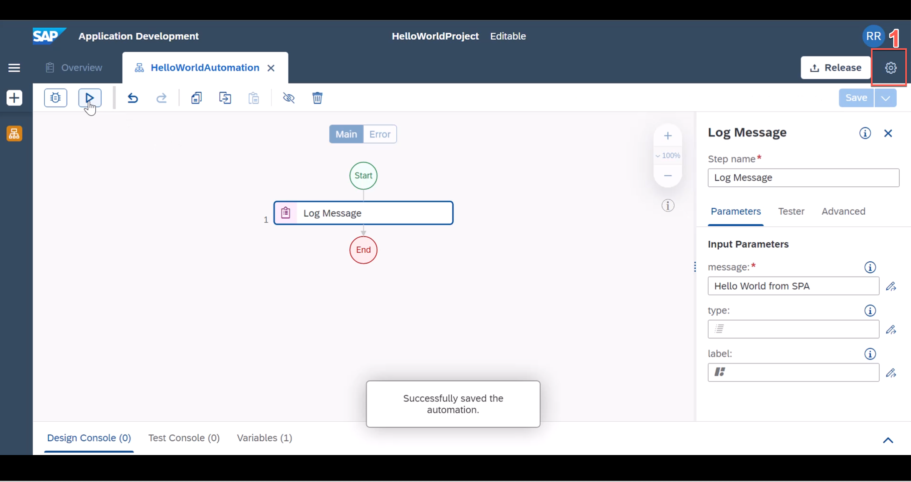
B2.  Select **Environment Variables** on left side menu option (1) and click **Create** Button | 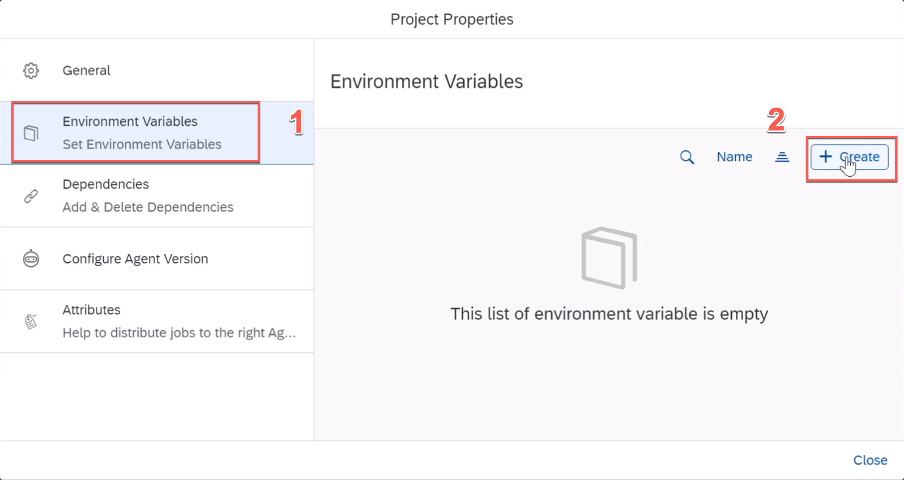
B3.  Enter a variable **name**, give a **description** and select variable type as **String** | 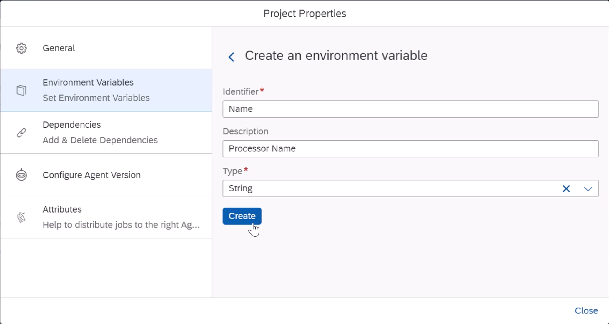
B4.  Click Close button | 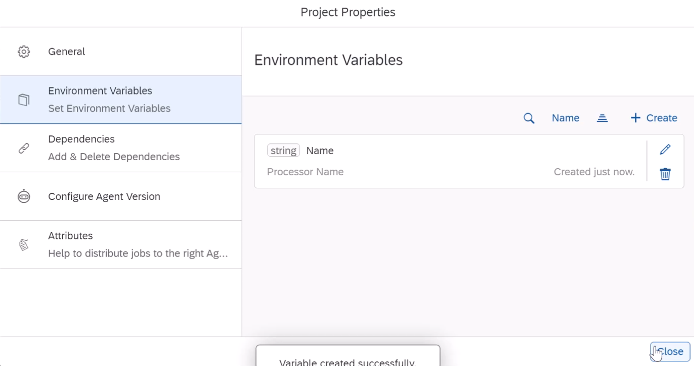
B5.  You should a success message | 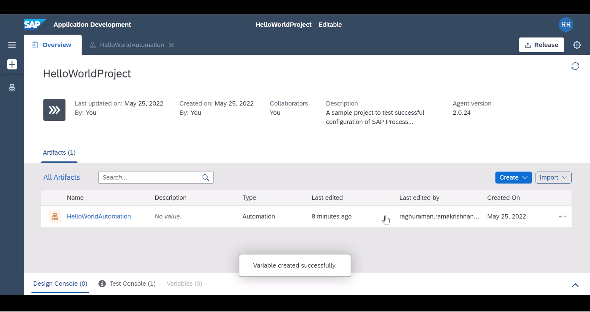
B6.  Add a second automation to the project | 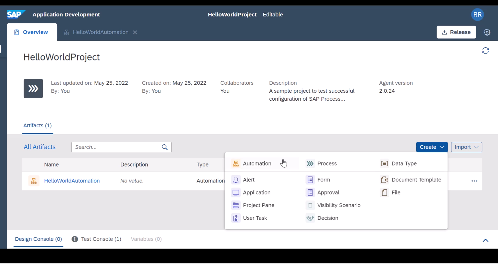
B7.  Give a name | 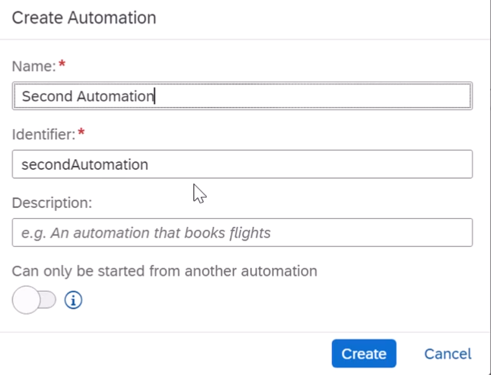
B8.  Add **Log Message** to the newly created automation | 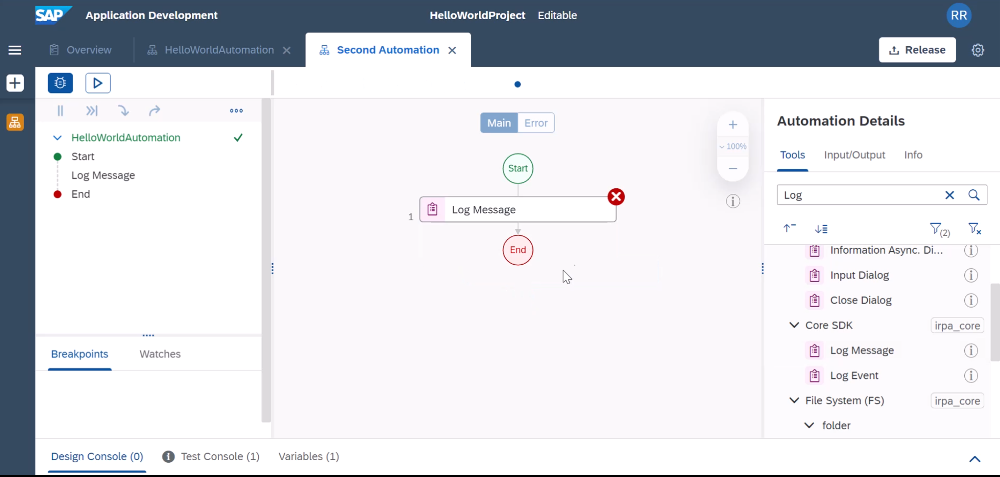
B9.  Add a new **Input Parameter** to the automation | 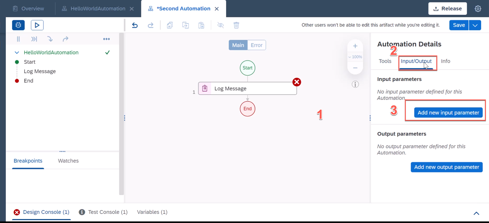
B10. You can give your preferred variable name. | 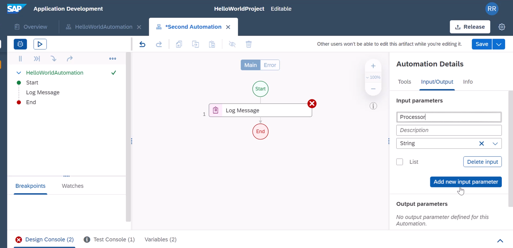
B11. Select Expression Editor | 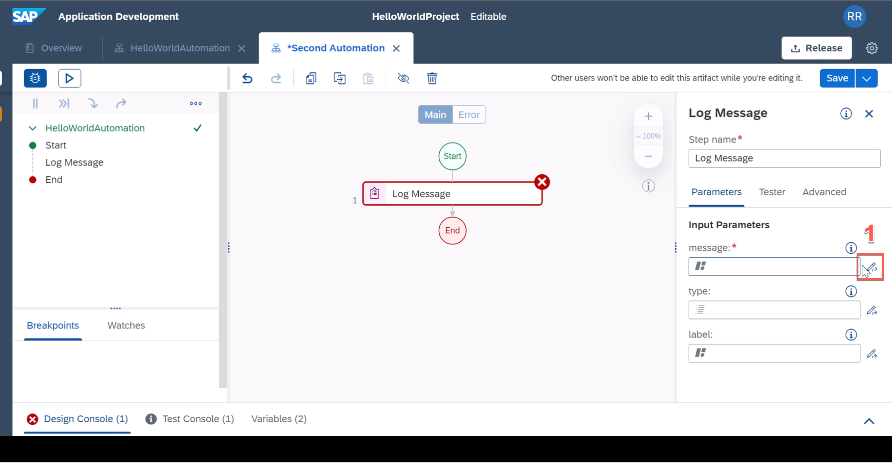
B12. In the expression editor, type **"Hello World by" +** and select any one of the  variable.  You can chose Environment Variable or input variable. | 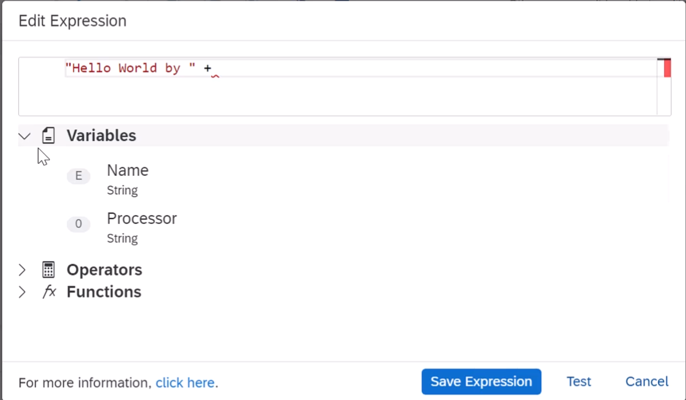
B13. LIke I said you can select any one value | 
B14. or this one. In real world it us your chocie. Here I am showing you different variable options that you can use in autoamtions. Click Save to continue | 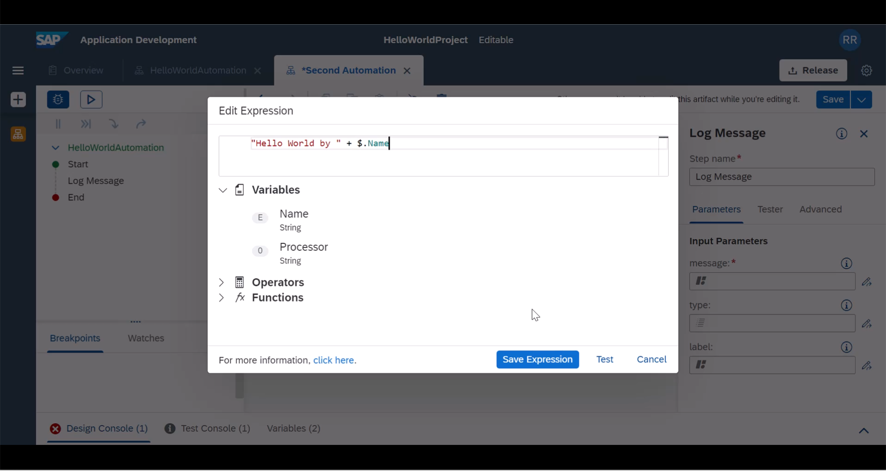
B15. Switch to Hello World Automation tab, find **Second Automation** on the right side activities list and drag it. | 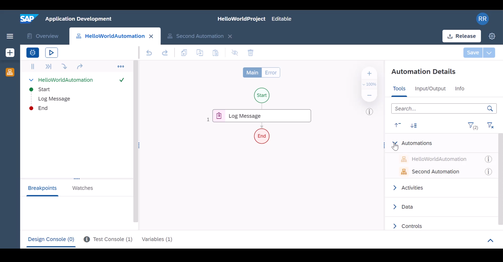
B16. and drop under **Log Message** | 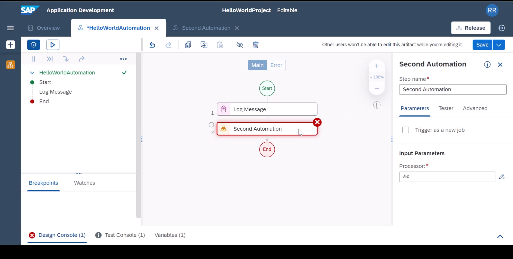
B17. since we have created an input variable in **Second Automation** we need to pass value from the **HelloWordAutoamtion**. | 
B18. Here I am going to simply pass the environment variable as it is. Click Save. | 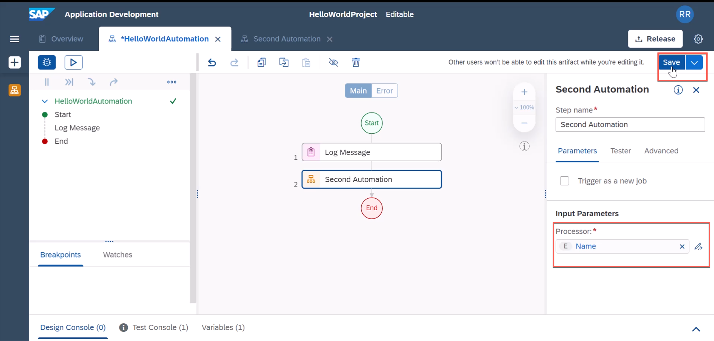
B19.  Now we are ready to test the bot again, this time you will be presented with a dialog box where you need to key in the value for environment Variable and click **Test** | 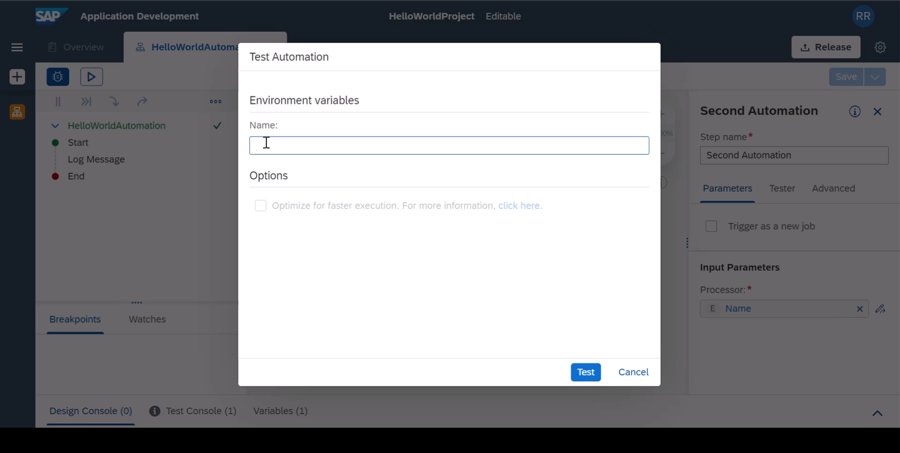
B20. It should now present 2 log messages based on your input value it will change | 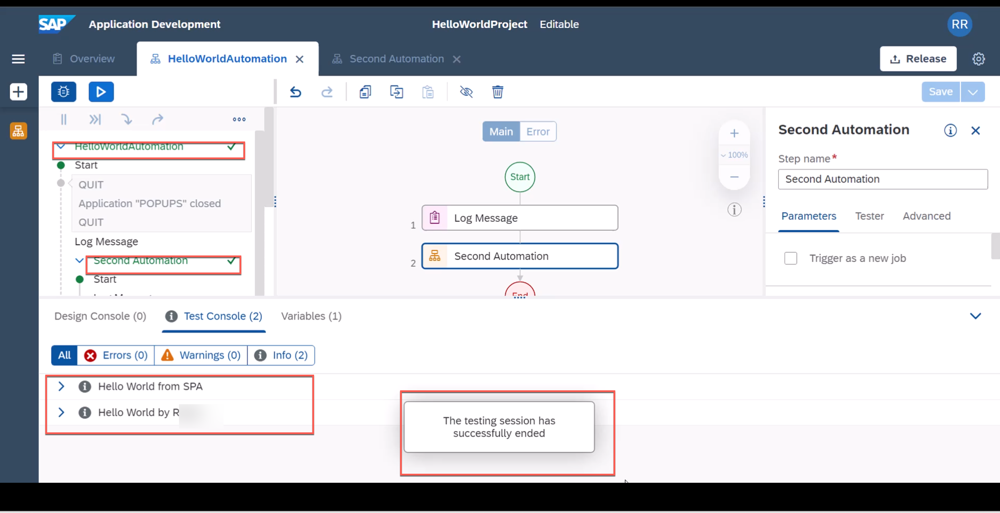

