Instructions | Image
------------ | -----
D1. Add a **Forever** loop activity after **Log Message** You can read mode about it from our documentation [page](https://help.sap.com/docs/IRPA/8e71b41b9ea043c8bccee01a10d6ba72/75f13165ec274305bfe13f56231f93e3.html) | 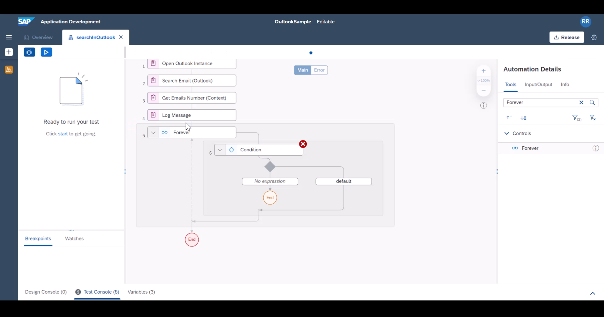
D2. Forever loop needs to make sure it is executed until there is one email in the search result. to know this, we will use **Check Current Email** which will return if there is any pending emails in the search context. While looping we will be using **Get Next Email (Context)** which will move the loop needle. | 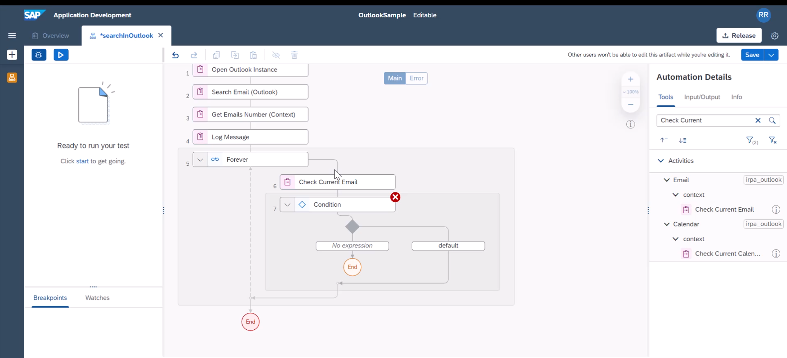
D3. This activity step is a boolean which you can see here | 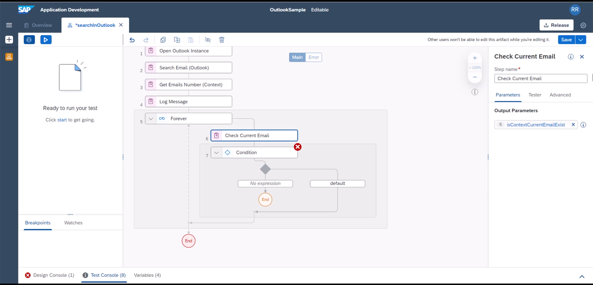
D4. We will use Condition Expression Editor and include **Is not** or **!** on the boolean. as the result of the previous step will return true if an email exists, we will stop the loop when there is no more emails to process.  Hence adding this to the check condition. Add the given expression through the expression editor and close it. |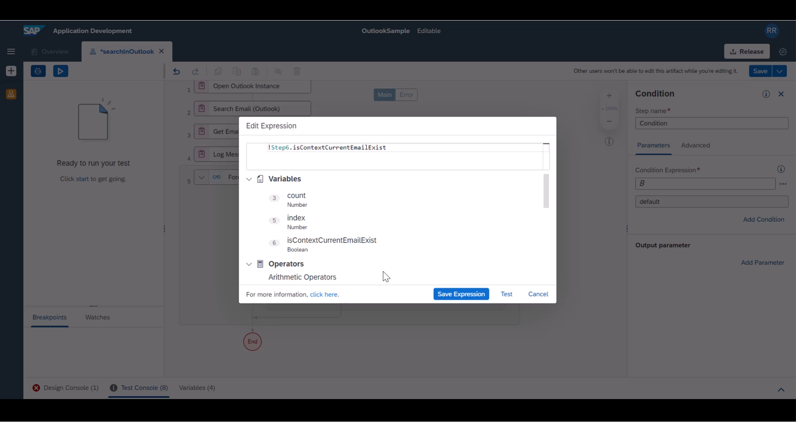
D5. Add a Log Message that loop has reached its end. You can give custom name if you wanted | 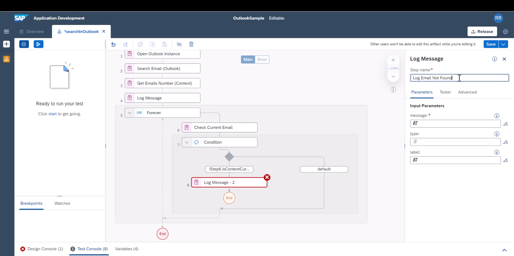
D6. Add appropriate log message to this step | 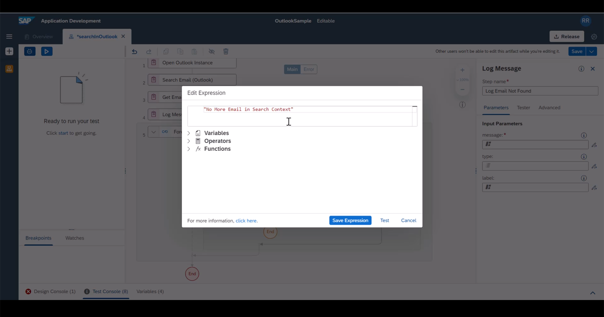
D7. Now to the default branch, we will log the loop index first | 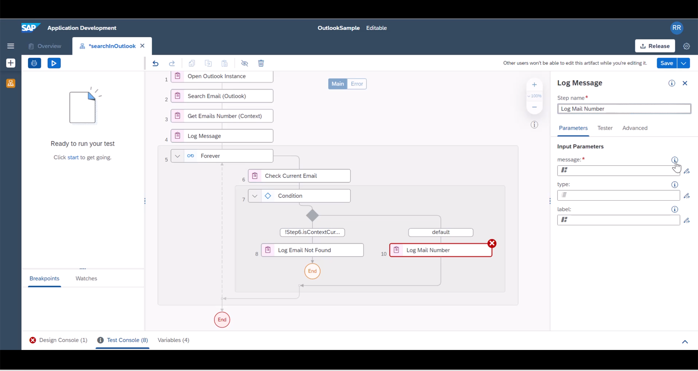
D8. Log a custom Loop Index message | 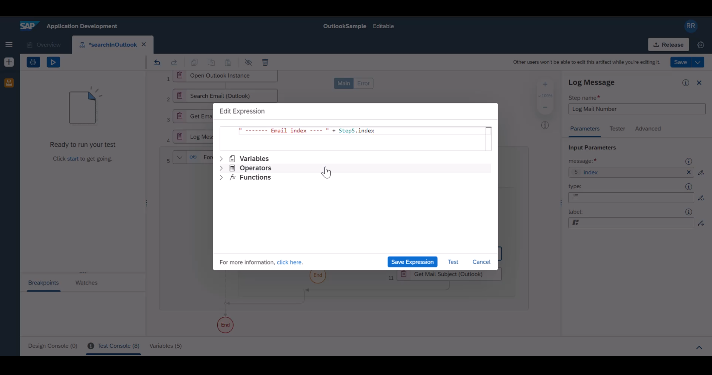
D9. For Each email in the loop context, let us retrieve its email Subject | 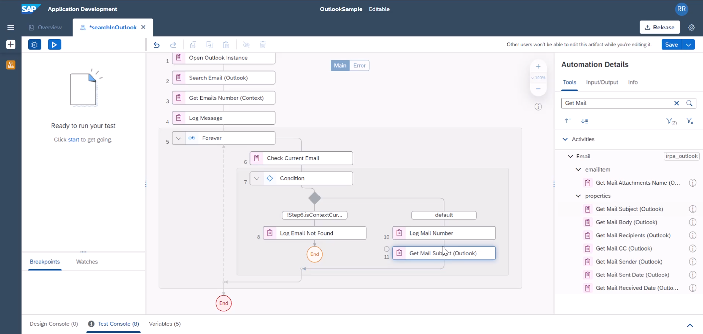
D10. Add a log message to print the email subject | 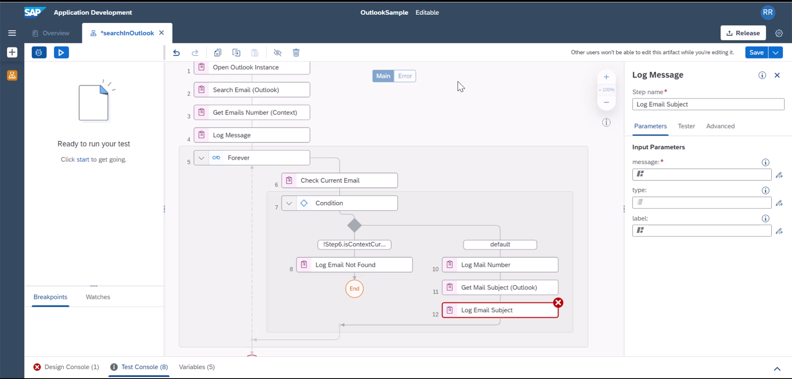
D11. To the log message event, add your custom message | 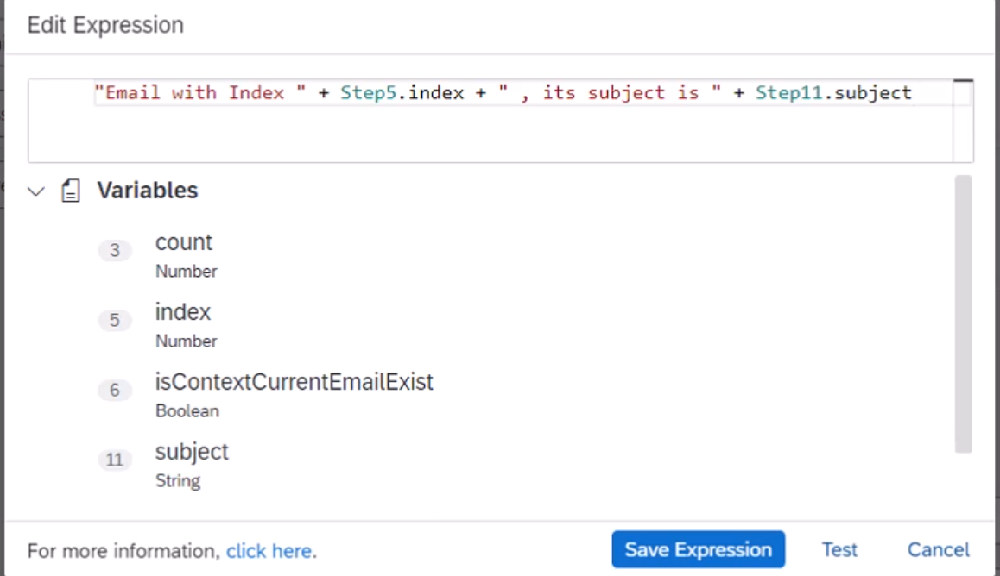
D12. Add **Get Next Email (Context)** to advance the loop variable | 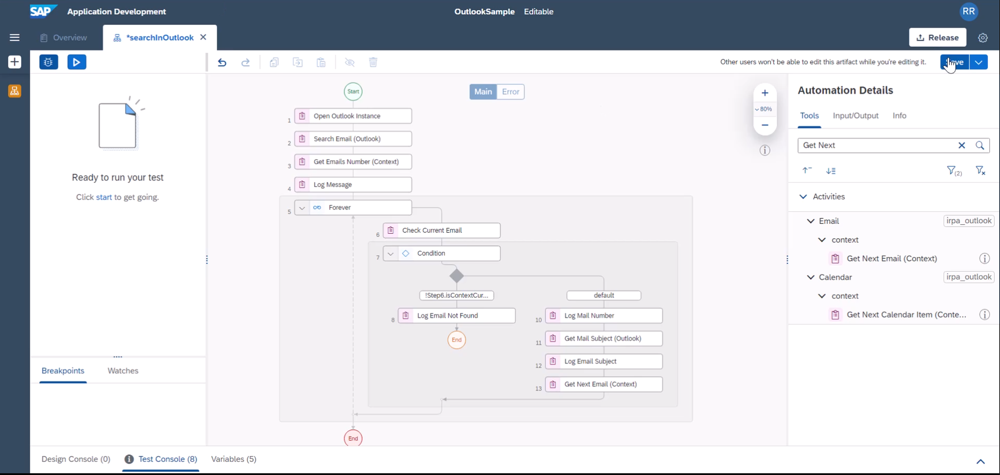
D13. Save and Test the automation, you should see appropriate results | 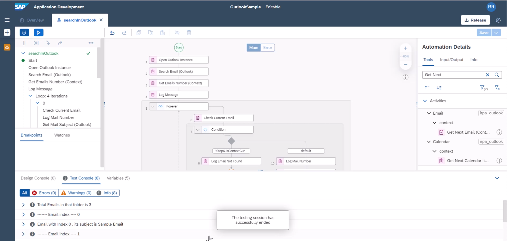
D14. Now add as many email attributes as you wanted to your flow | 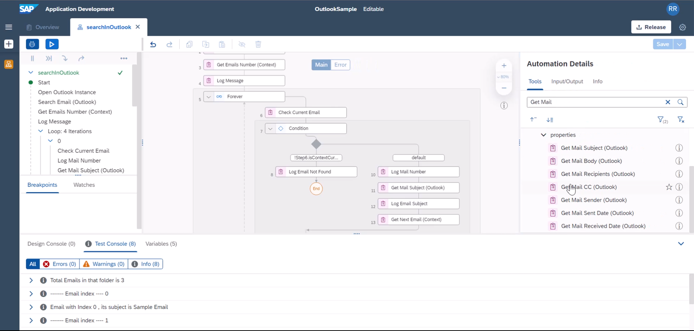

**END**