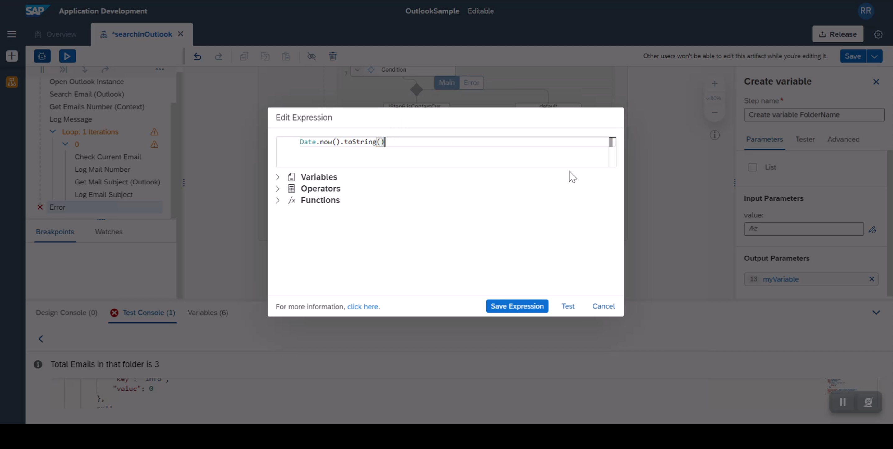
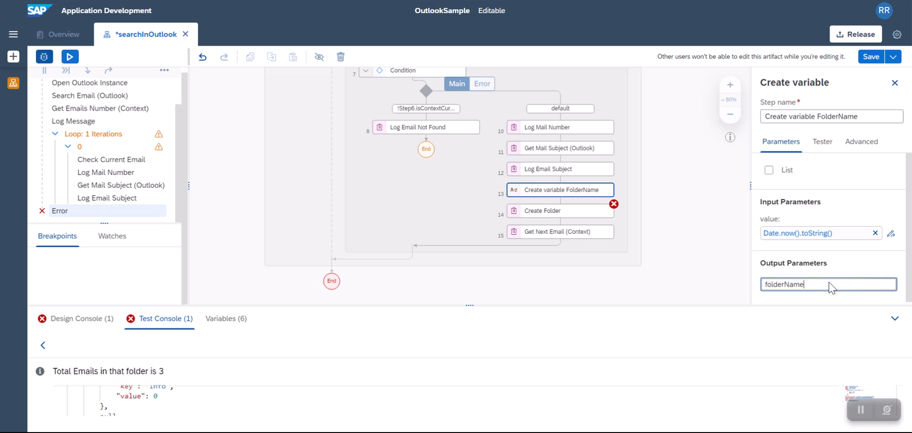
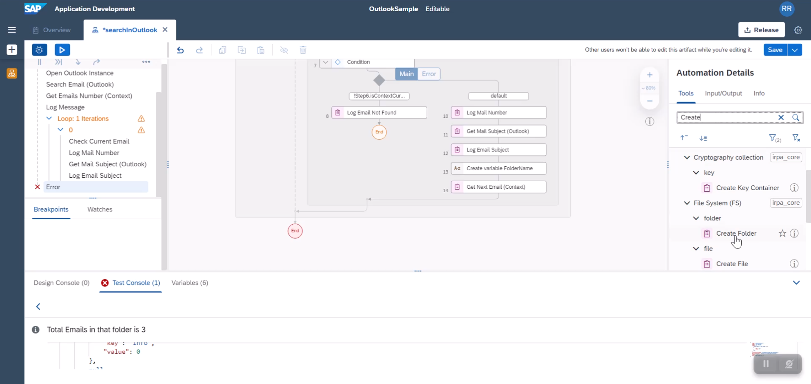
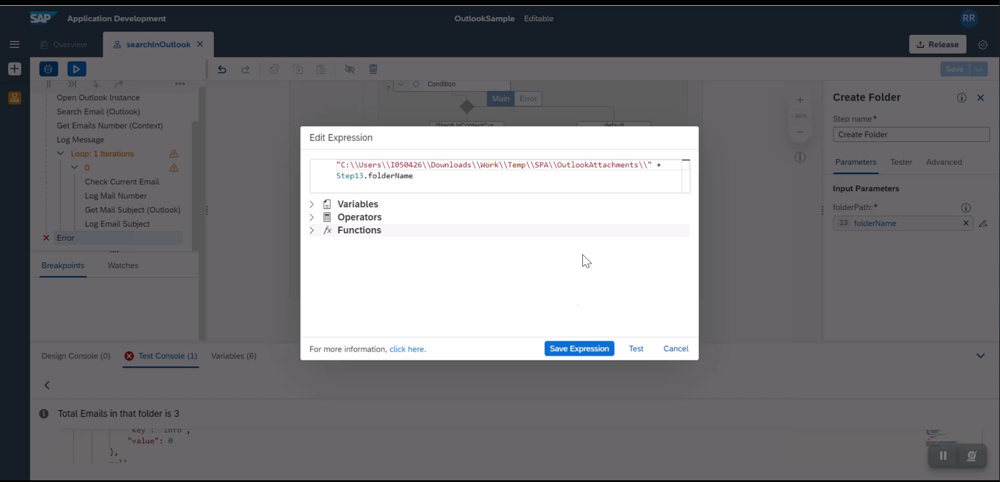
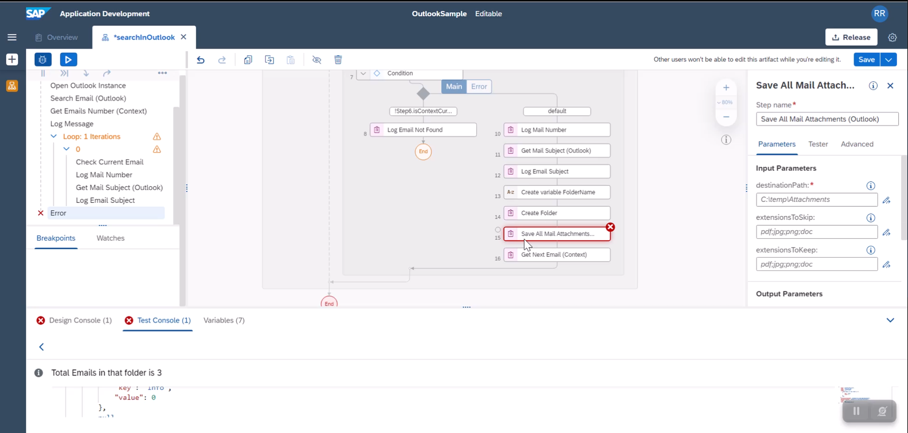
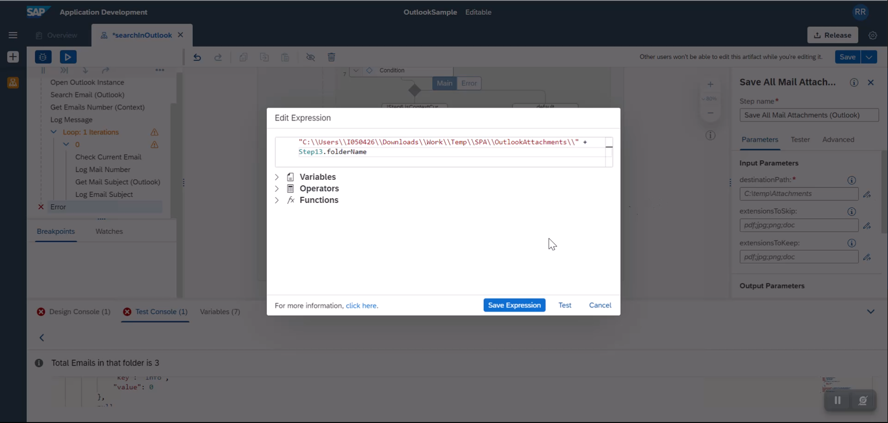
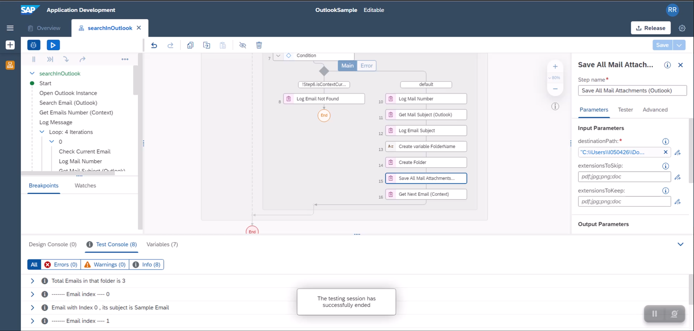
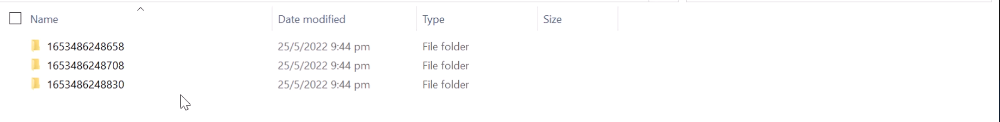

In this tutorial, we will create a folder in your windows file system. We will define folder name dynamically using current timestamp. Then each email attachment to that loop based folder name.

Instructions | Image
------------ | -----
E1. Create a string variable folder name. For this we will drag **String** datatype and drag and drop into folder. actually above **Get Next Email (Context)** activity | 
E2.  To the string variable, we will assign a timestamp value as its value. this is done using **Date.now().toString()** | 
E3. Just make sure you set the output of create String variable is set to your desired variable name | 
E4. Using the folder name we will create a folder in the file system. we will drag relevant **Create Folder** from the **File System** collection and drop it to the flow | 
E5. Refer a location in your windows drive, and append the folder name. make sure you append **double slash** to the path structure | 
E6. Add **Save All Attachments** to your flow. You can individually save every attachment using **Save Mail Attachment** , good idea for you to explore difference between both these options | 
E7.  We will refer the folder path from **E5** as the destination location for saving attachments | 
E8. We will test run the execution. | 
E9. You will see relevant folders with attachments | 

**END**