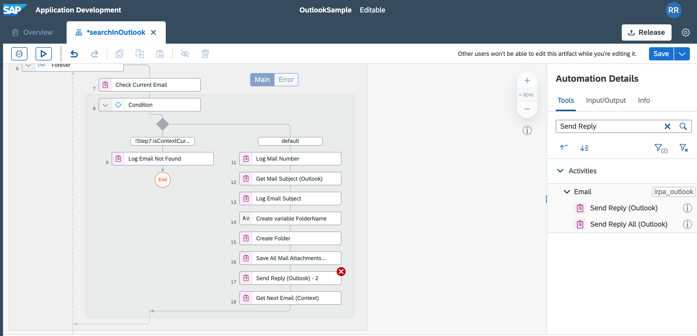
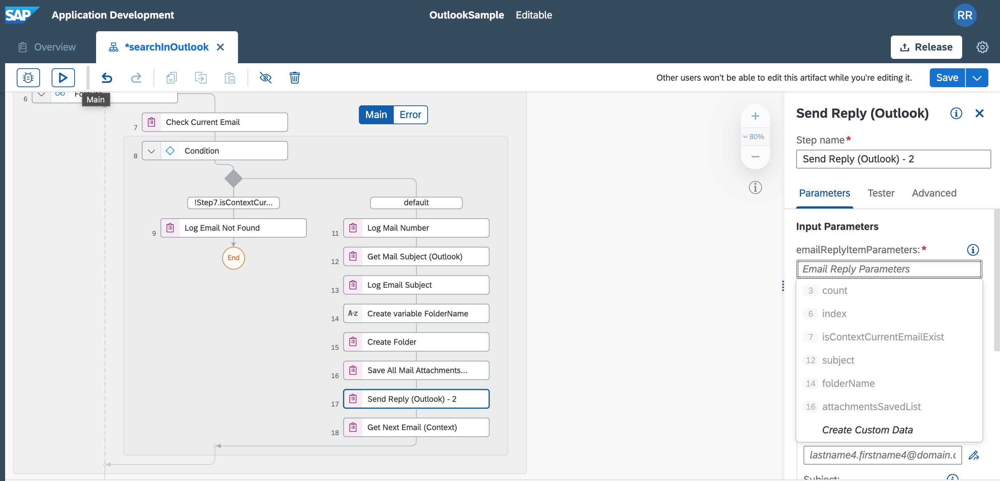
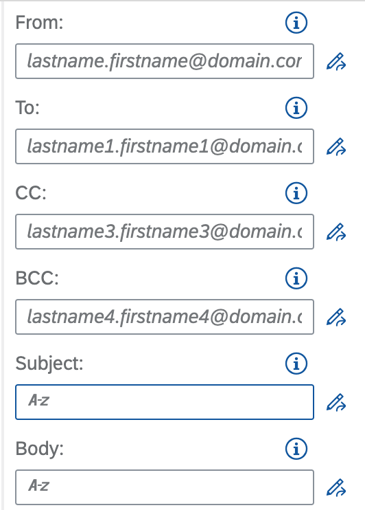
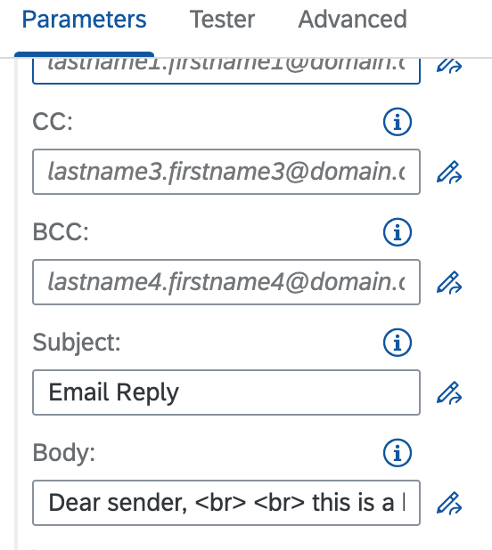
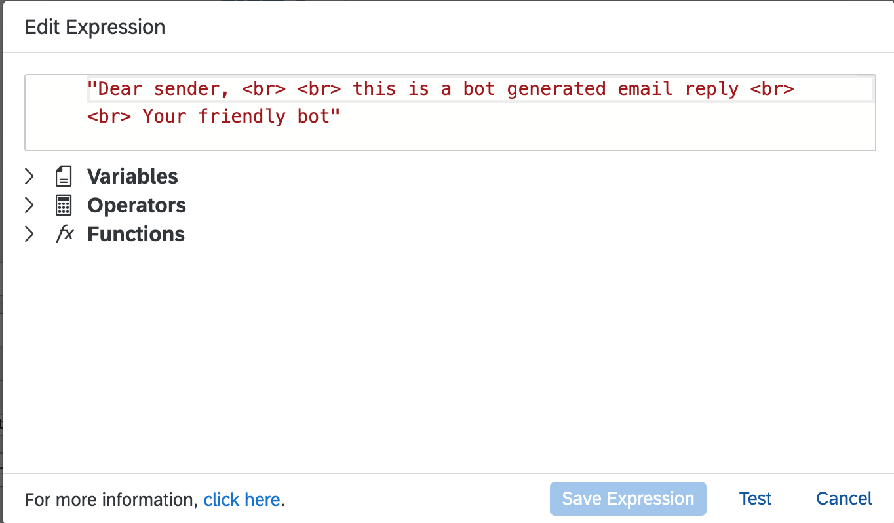
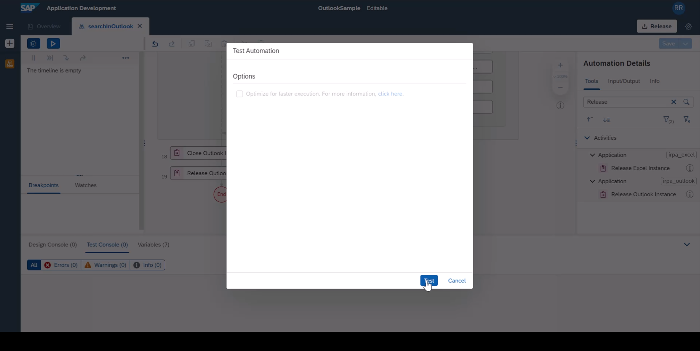
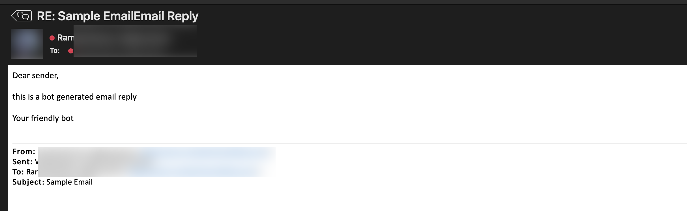

In this tutorial, we assume you finished process the email in context related data, say with the file that was saved and you wanted to move the email from current folder to "Processed folder". 

Instructions | Image
------------ | -----
F1. Add **Send Reply (Outlook)** activity to the flow after **Save All Attachments** activity | 
F2. Add a **Create Custom Data** to the email reply activity | 
F3.  You can optionally include additional attributes like cc, bcc in your reply | 
F4. In my case, I added a custom subject to my reply as **Email reply** . This will get amended to the reply subject| 
F5. You can include custom message as email body in your reply | 
F6. Save and Test the project | 
F7. You can validate the result by checking your email reply | 

**END**

> Do review our Microsoft Outlook best practices from our help documentation [page](https://help.sap.com/docs/IRPA/8e71b41b9ea043c8bccee01a10d6ba72/5a48c81502db40b08e4aac866e04592a.html)
> Also dont forget to review Outlook Email Best Practices Automation from our [RPA Store]([SAP Intelligent Robotic Process Automation Store (ondemand.com)](https://store.irpa.cfapps.eu10.hana.ondemand.com/#/package/a4c61c62-356e-4165-bdcb-bef08e236cf5)