Instructions | Image
------------ | -----
C1. Create a new Automation project from within SAP Proceess Automation Lobby | 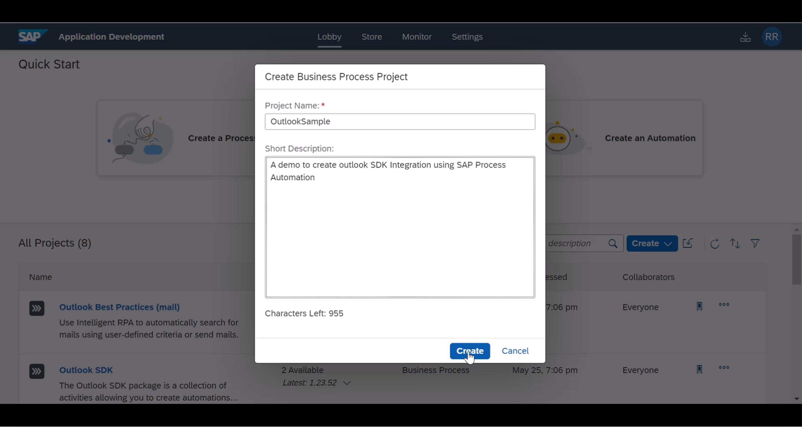
C2. Select latest Agent Version | 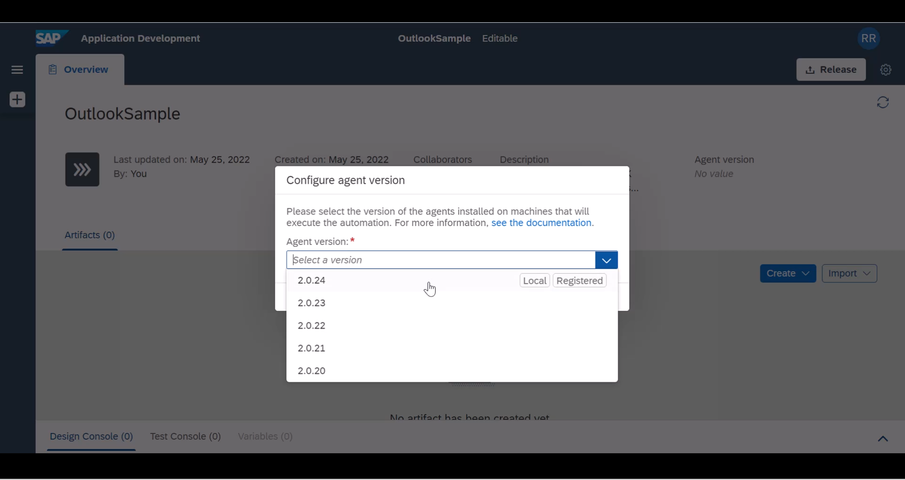

> Note by the time you follow these scripts, newer Desktop agent versions may have been introduced. so always install the latest version of desktop components and select the latest version of agent.

Instructions | Image
------------ | -----
C3. Create A new autoamtion wihtin your project | 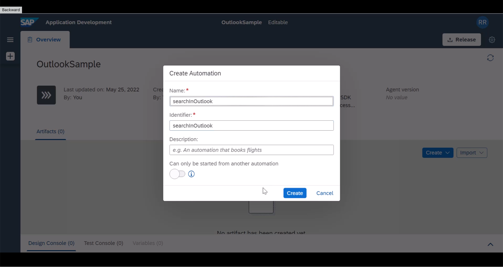
C4. It will add necessary basic dependencies | 
C5. As a first step, we need to include Outlook SDK Depenency to this project. Locate the settings wheel icon in your project | 
C6. Add Outlook SDK dependency | 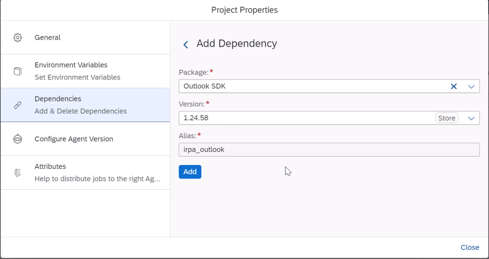
C7. Add **Open Outlook Instance** from the activities pane to your automation | 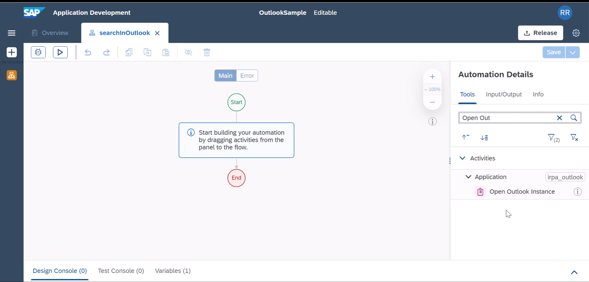
C8. Drag it onto your automation flow | 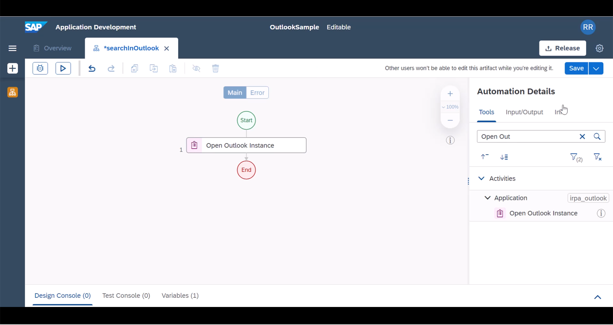
C9. First we will attempt a simple folder search. so locate **Search Email** activity and add it to the flow | 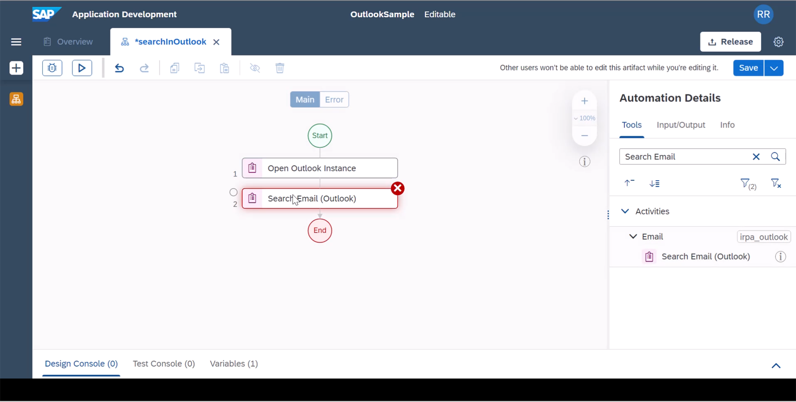
C10. Select the newly added activity and **Create Custom Data** as search criteria | 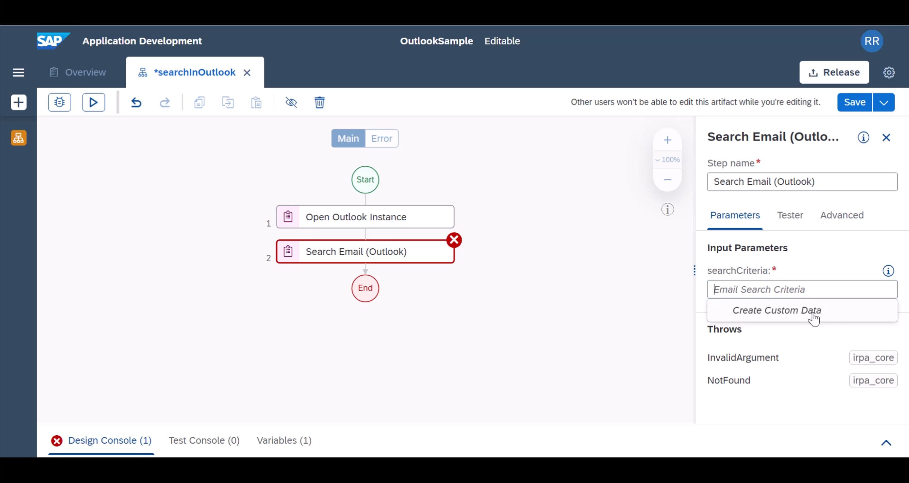
C11. Provide a folder to search in your inbox and storeName refers to the email inbox you wanted the SDK to change. Some may have additional mailbox configured within the outlook application, this field could be handy to search specific inbox based folders. | 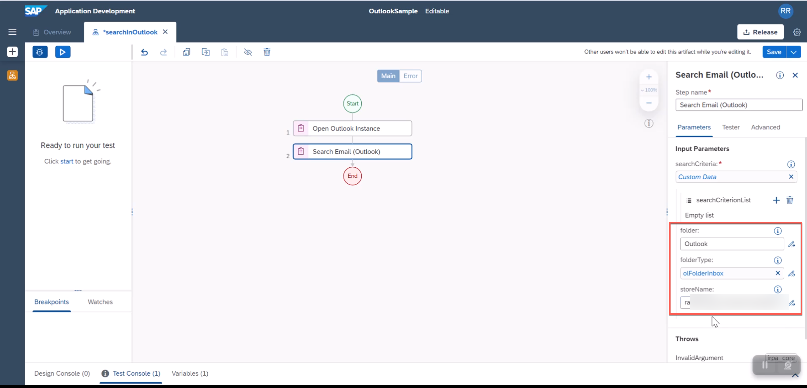

> Note Review the option *Search Criterion List* , you can include additional search criteria like emails with specific subject or from specific sender. You can refer to our documentation [page](https://help.sap.com/docs/IRPA/8e71b41b9ea043c8bccee01a10d6ba72/2ea6c87f0bef430f9aed40eb824576bc.html) for additional information
 
Instructions | Image
------------ | -----
C12. Add **Get Emails in Context** activity to the flow. Previous step creates a context which is what we are going to use in our next steps. | 
C13. As a simple check, we will find out how many emails in that folder. For this we will add **Log Message** activity | 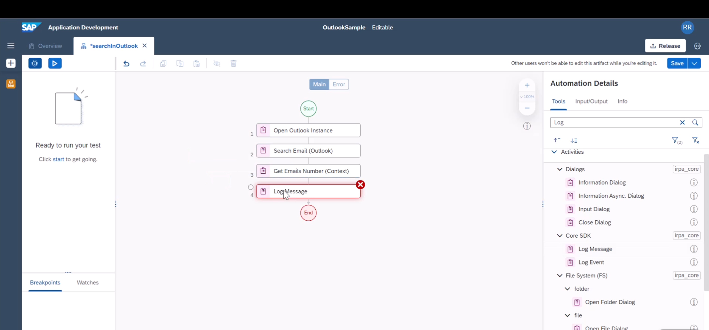
C14. and include a custom message using the expression editor | 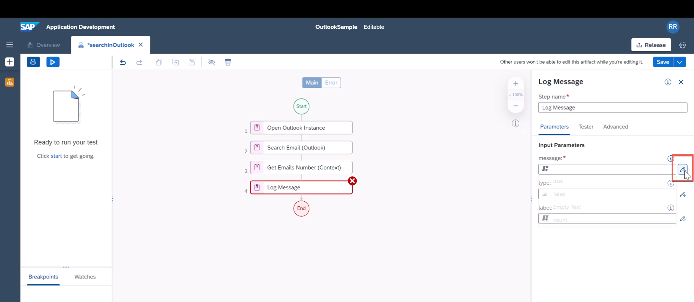
C15. Add custom message to log the total emails in search results | 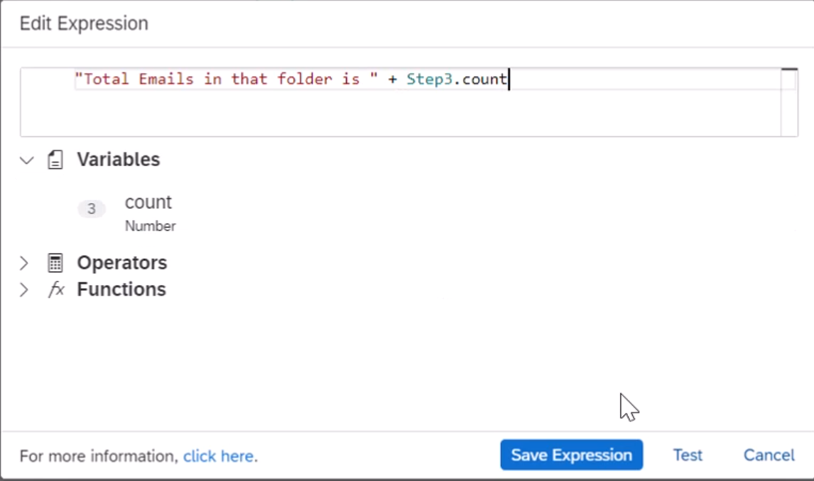
C16. Add **Close Outlook Instance** and **Release Outlook Instance** to your flow. This is always required with an **Open Outlook Instance** call | 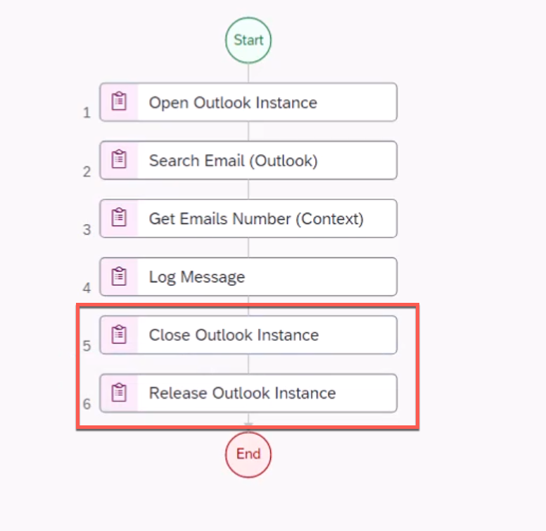
C17. Save the project, test run the project, you should see your expected result | 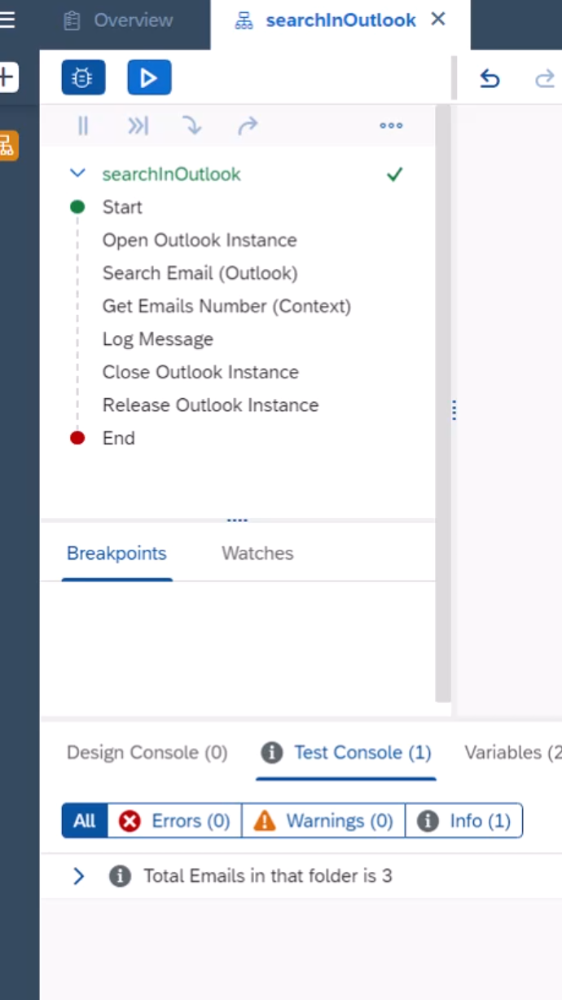

**END**