In this tutorial, we will use one of the basic  excel helper function with Automation in SAP Process Autoamtion. This is Excel Cloud Link

Instructions | Image
------------ | -----
G1. As a first step, let us get started with adding **Open Excel Instance** | 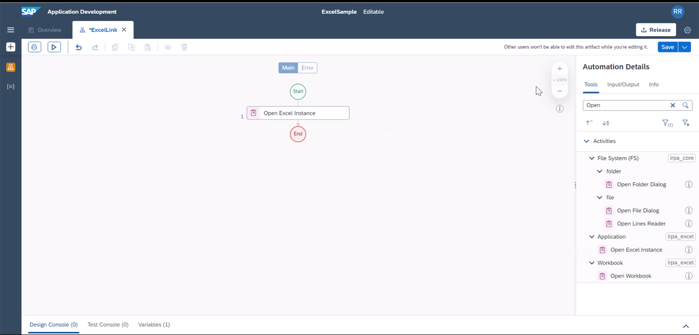
G2. Similarly add **Excel Cloud Link** from the activity pane | 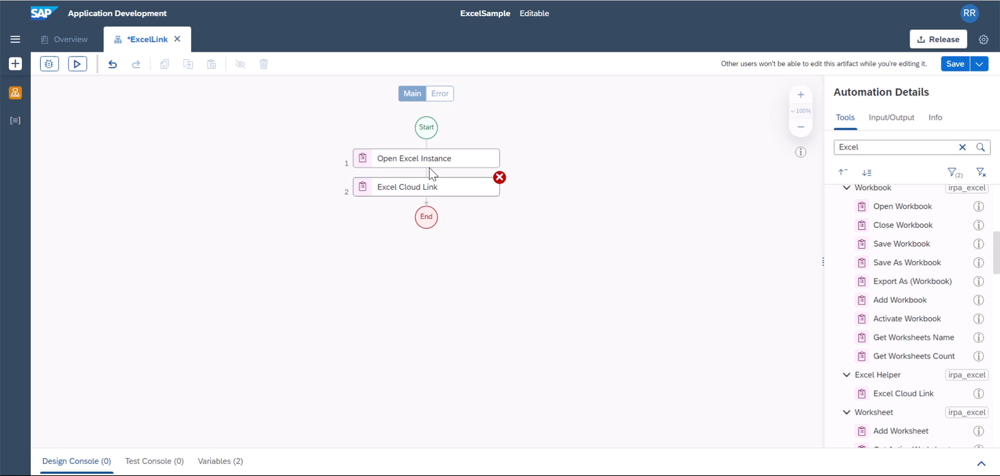
G3. Click Edit Activity | 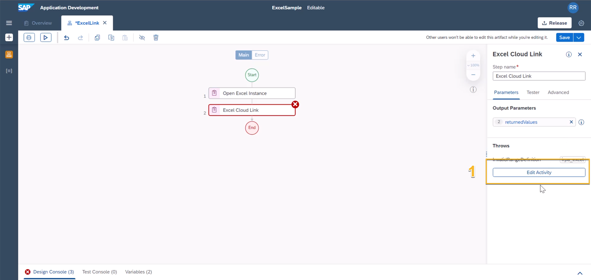
G4. Drag and drop an excel (1). you can use [this excel](Documents/Customers.xlsx) in case you dont have one. | 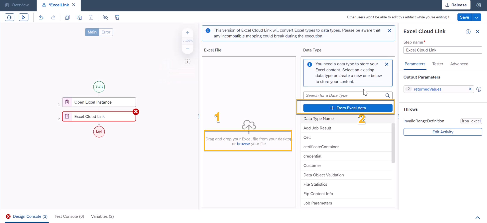
G5. You can see, the excel cloud link helper capabilities, it already pre-selects the first sheet, it groups data by column names, it also finds out in few seconds the complete range of the excel | 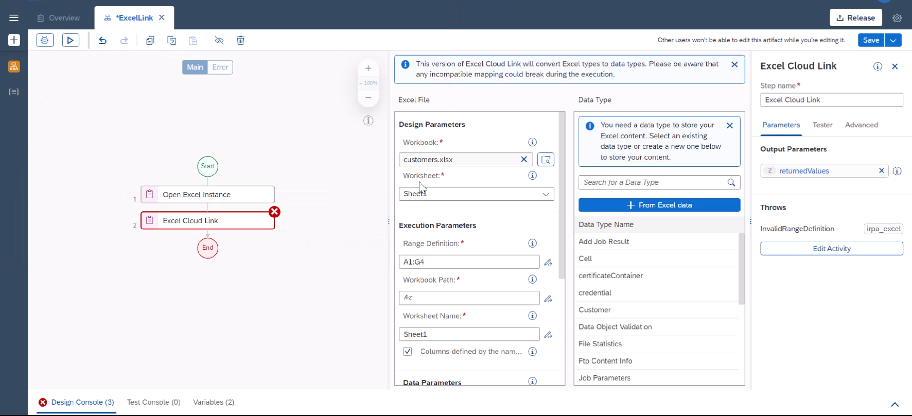
G6. While excel cloud link is great in processing the data, it still needs for runtime reference, path for the excel. Typically excel path = folder path + file name. Plase this location into the path varianle. | 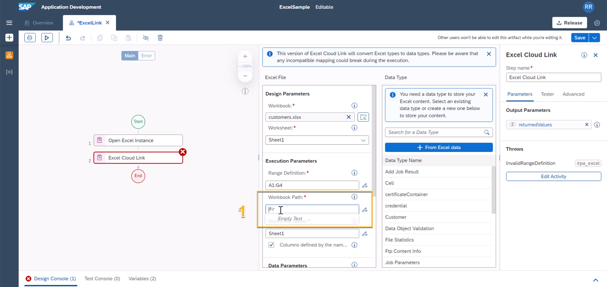 
G7. You can also create a data type out of the added excel by using the excel data structure (2) | 
G8. Provide a data type name | 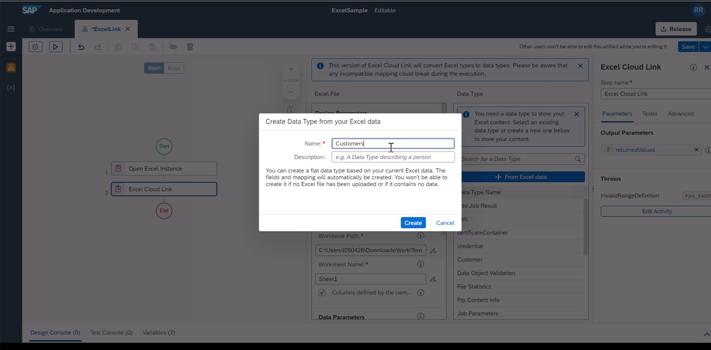
G9. If you prefer you can edit output parameter on the right side | 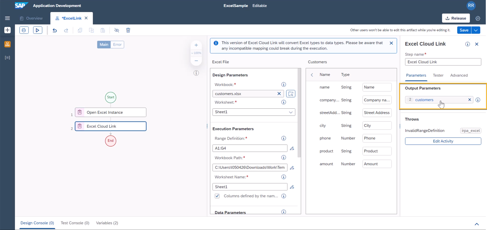
G10.Now we will see the benefit of using excel cloud link by printing output parameters. For this we will use a loop variable **For Each**  | 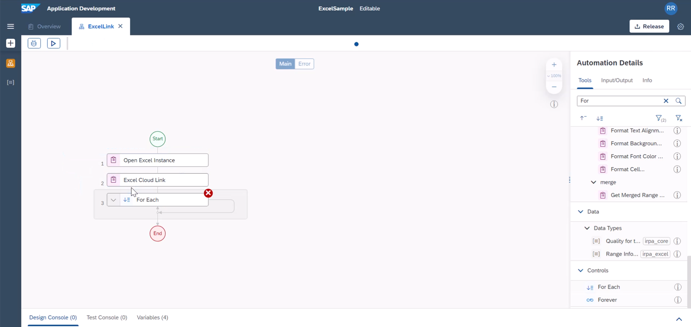
G11.  As a loop variable, you can add the output parameter from step 2. | 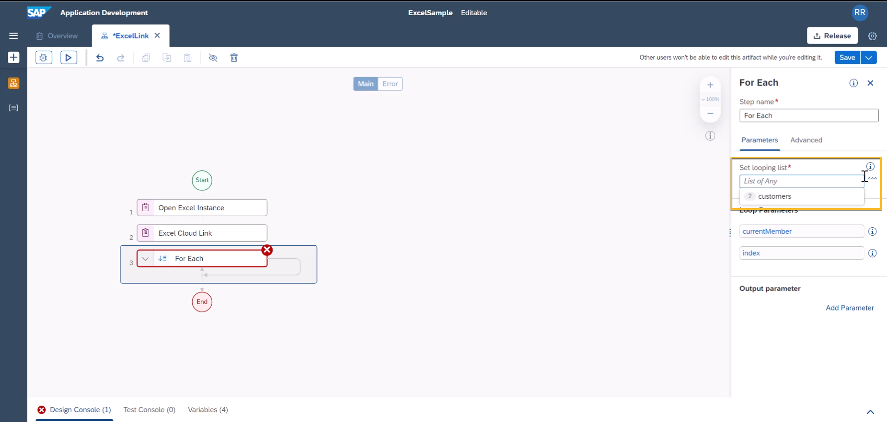
G12. We will print customer name. let us add **Log Message** | 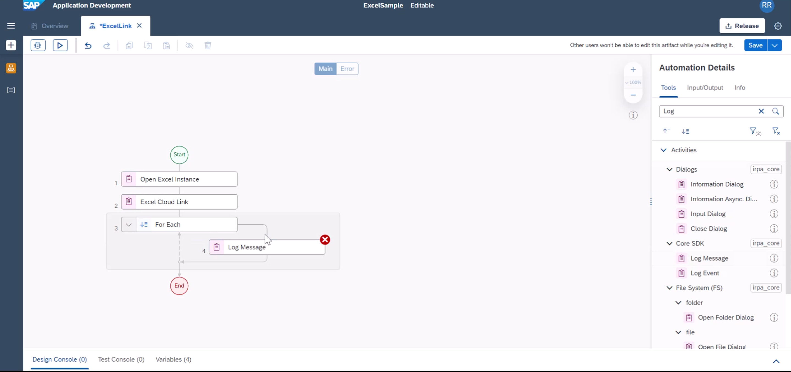
G13. Initially we will add **Customer.name** | 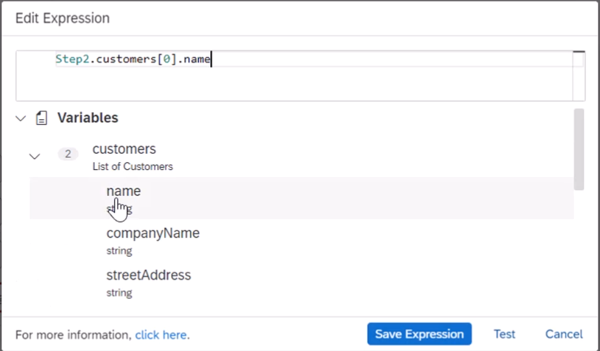
G14. At first it takes 0-th index. But we wanted to use **index** variable so each loop iteration, it can print corresponding rows customer name | 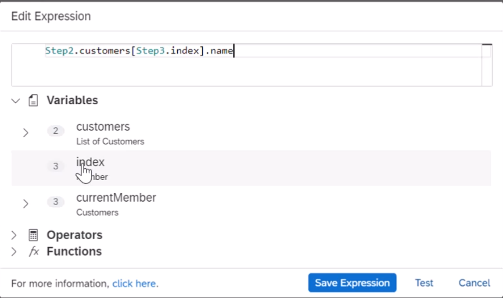
G15. We will now add **Close Excel Instance** as we added **Open Excel Instance** in the first step | 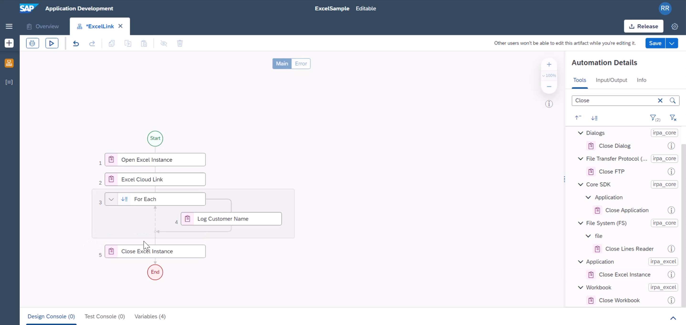
G16. Now you can test the output after saving the project. | 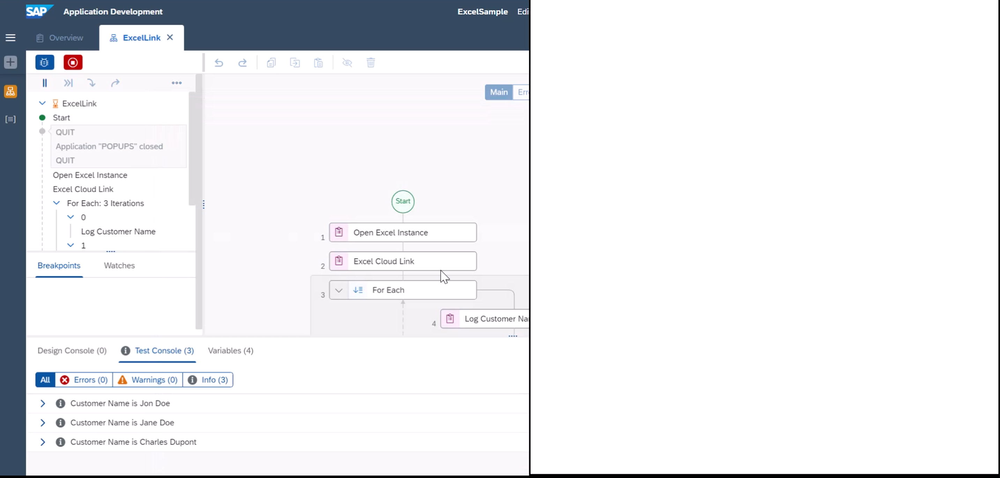

> SAP Help [Documentation]([IRPA SDK V2 (sap.com)](https://help.sap.com/doc/b8b5c9bbac3846a0a57aedab3f412880/Cloud/en-US/modules/helper.html)) on Excel Cloud Link
> Excel Cloud Link [Video demo]([How to use the Excel Cloud Link activity helper on Vimeo](https://vimeo.com/458204726?embedded=true&source=video_title&owner=122956519)
> Community [Blog]([Quick automation with iRPA – Excel SDK | SAP Blogs](https://blogs.sap.com/2021/05/31/quick-automation-with-irpa-excel-sdk/) on Excel SDK 

> In the next exercise we will do the same output, but without using Excel Cloud Link. this will show you the power of excel cloud link, but also if your need is to process dynamic excel sheets, you can use variable to process in the 2nd exercise approach ins tead of using Excel cloud Link.

**END**