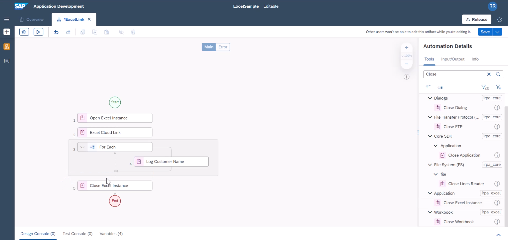

In this tutorial, you will read excel without having to use excel helper excel cloud link. This will help you to do things dynamically, also play with excel specific functions like calling a macro, applying filters or formating. so the usage is much beyond reading values of the excel

Instructions | Image
------------ | -----
H1. Let us start with a new automation project **ExcelSamplev2** and add **Open Excel Instance** to the project. | 
H2. We will create couple of string varilables to create base folder and file name. from the activity search for **String** | 
H3. One Variable will point to the base folder path and second variable will point to file name. Creating them in this form, helps to use in subsequent activity types. | 
H4. We will also call **Get File Name** activity to fetch the fileName. you can avoid this by creating a string variable for the file name | 
H5. We will add **Open Workbook** activity and point to the full path (folder + file name) | 
H6. Subsequently we will activiate the workbook and the first worksheet. Value for activate work book is the file name from step **H4** and value of activate worksheet is the first sheet name. You can use variables or hardcoded values for now. | 
H7. Now that excel sheet is open, you can apply filters, hide columns or get values from a range of cells or add a new sheet and copy  a range of values to the newly created sheet. | 
H8. You can add **Get Values (Cells)** to fetch specific range cells and subsequently you can validate the step using output parameter through **LogMessage**. You can now see these many steps can be saved when you use **Excel Cloud Link** | 
H9. Now Add **Filter Range** activity. In the filter range, we specify the range where the filter needs to be applied, along with the column on which the filter needs to apply with a filter condition | 
H10. In the project, I added one more filter range expression, but it depends on your logic. Subsequently you can add Hide column to hide a specific column in the result| 
H11. Now we can attempt to copy the result of filter to a new sheet. For this we will first add a sheet through **Add Worksheet**  We will give it a name **Result** | 
H12. This will activate the new worksheet, but for us to copy from the filter results to ths new sheet, we will switch to that sheet again and copy the values. | 
H13. We will add **Copy Range** and provide the source range, destination worksheet and workbook values and starting cell for copy. | 
H14. We will activate the new sheet now in order to save it | 
H15. Now add **Save As Workbook** to save the new sheet as another file. You have option to save workbook as an excel file or csv file. for this tutorial, I am saving it as a new csv file. so a filePath, I will need to give folderName + fileName without extension where this needs to be saved.|  
H16. Finally we need to include **Close Excel Instance** to conclude the step | 
H17. You can save the project and test it to validate the result. | 

**END**