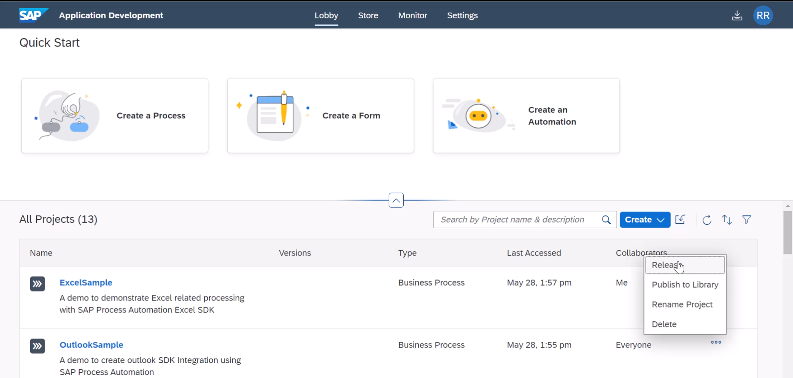
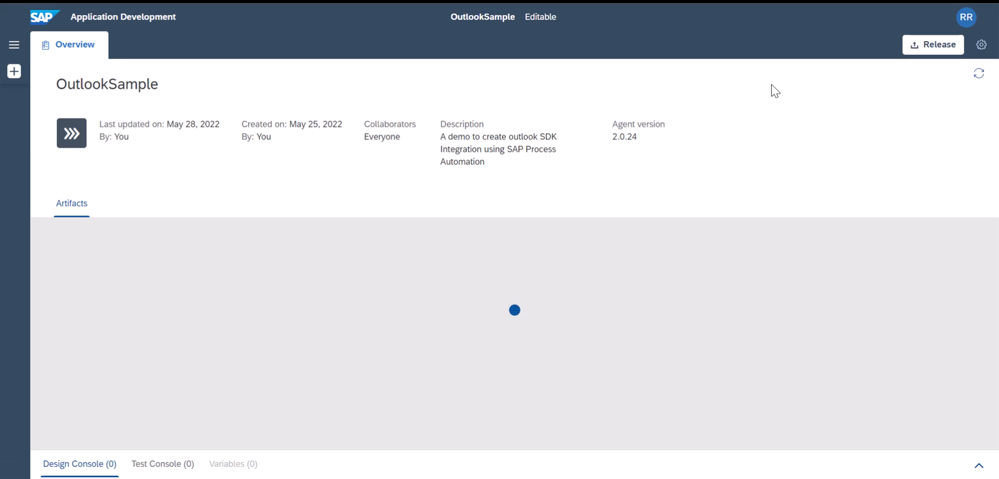
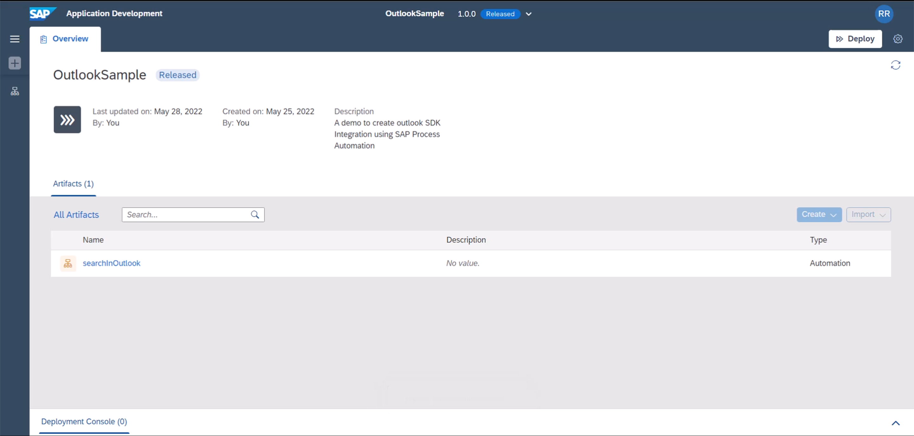

In this tutorial, we will prepare our excel project from E2 Outlook and modify the same to modularize its content execution based on environment variables.

Instructions | Image
------------ | -----
I1. As a first step, we will release the in preview project to released project. You can do so in two ways. (1) Either you can do so from Lobby by pressing **(...)** or from within the project you can do so by clicking the button **Release** | 
I1.1 Another way to release the project | 
I2.  At release time, it will ask you to specify a version number, you can accept the default suggestion | 
I3. Notice the name change from Editable to (version number) Released | 

**END**