In this tutorial, we will customize the excel project to the needs of a common project.

Instructions | Image
------------ | -----
J1. As a first step let us add **Get Folder Collection** to the **baseFolderPath** environment variable. This step will return all the sub folder names within a given fodler name. in our case, it will give each timestamp based folders fetched from each email from the outlook. Rename the output parameter to **folderList** | 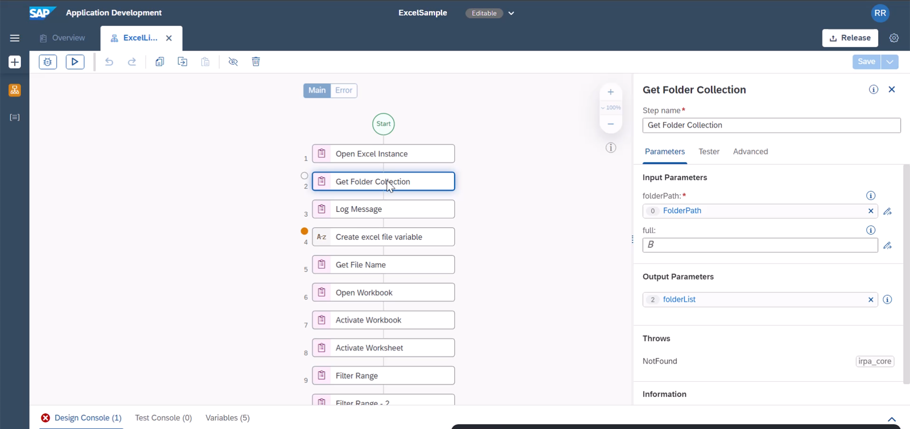
J2. You can see the result by using a **Log Message** | 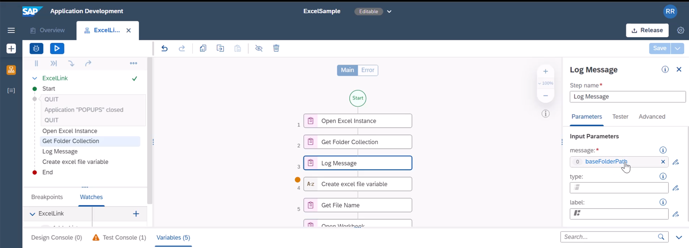
J3. We will loop through each folder. for this will add **For Each** loop to the flow | 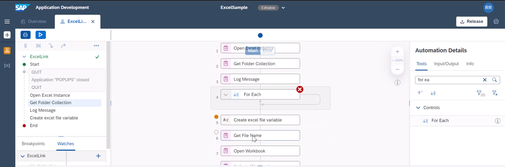
J4. We will add all the required steps into the folder. the idea is on each file, a certain set of actions needs to be performed | 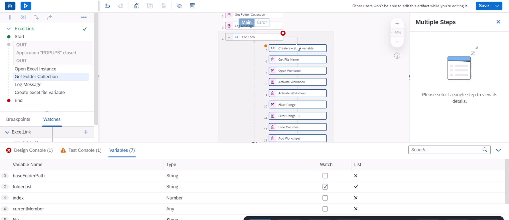
J5. Within each index of **For Each**,  we can fetch list of excel files in each folder. for this, we will add **Get File Collection** to the loop | 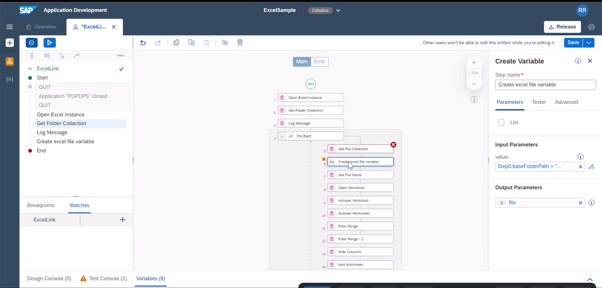
J6. the value for **Get File Collection** is as given in the image | 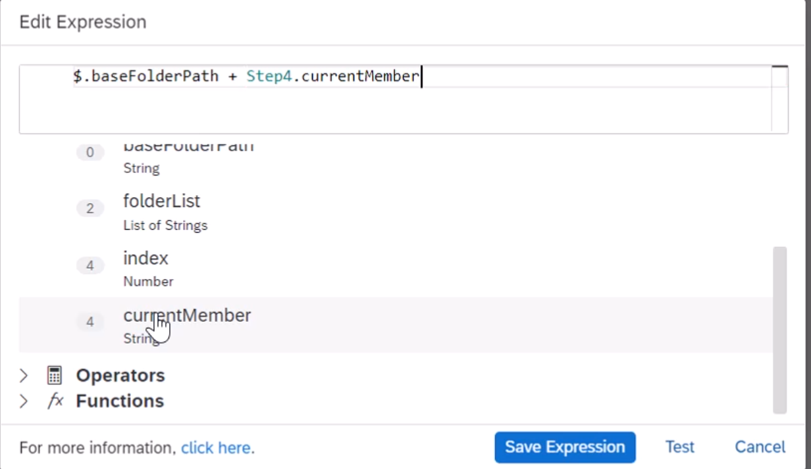
J7. We will add one more **For Each** to loop through each excel file in that sub folder. Here to distinguish both the loop variables, you can rename it appropriately. Also include the required excel actions within this sub **For Each** loop. | 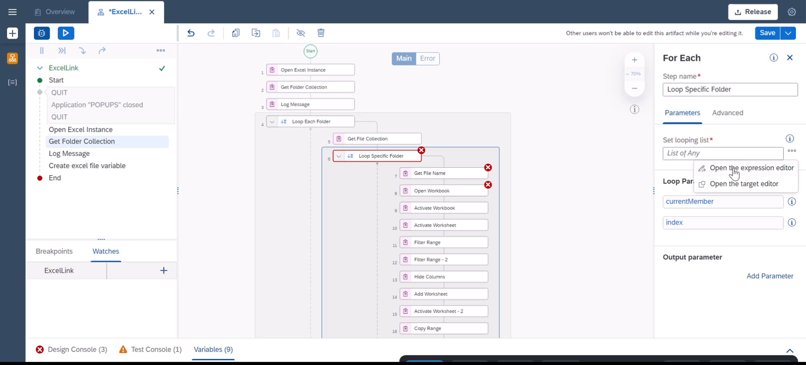
J8. first create a string variable to generate from the loop variable full path to the excel file | 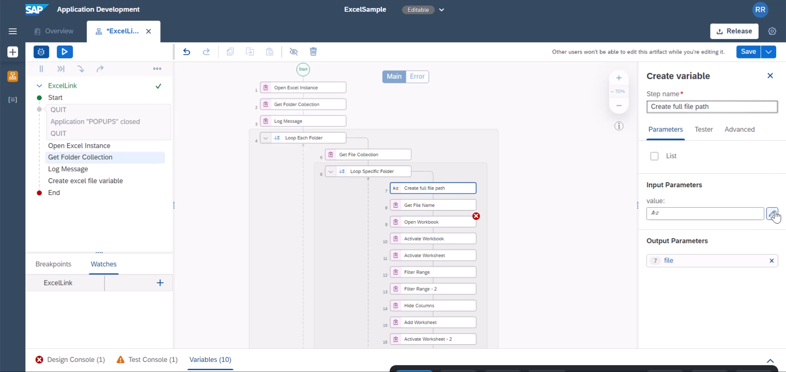
J9. Adjust the **Get File Name** to take the output variable | 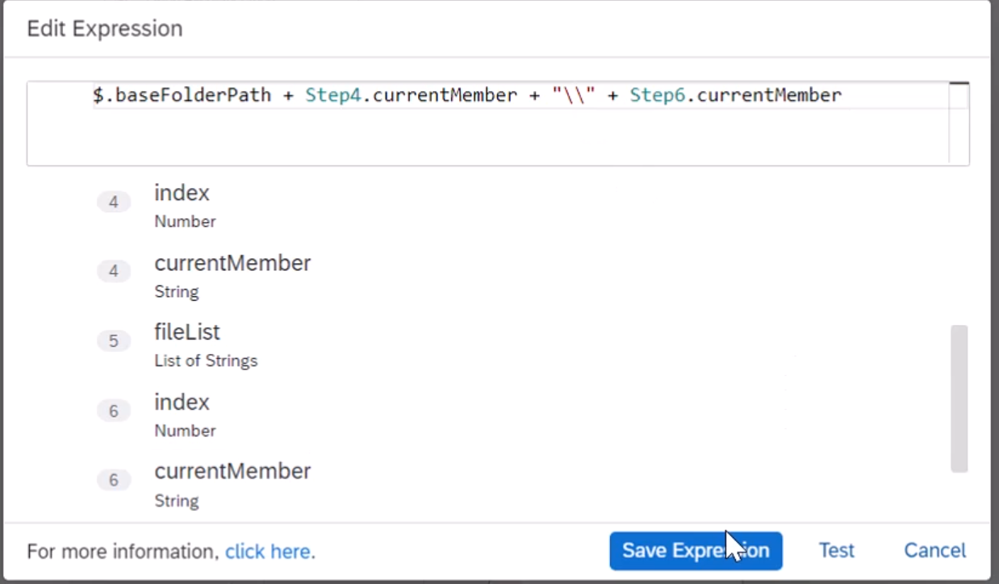
J10. We have hardcoded ranges in **Filter Range**. when we generalize the functionality, we may wanted to calculate this at run time. For this, we will be adding **Get UsedRange Row** and **Get UsedRange Column** activities to find out the start and end cell values. |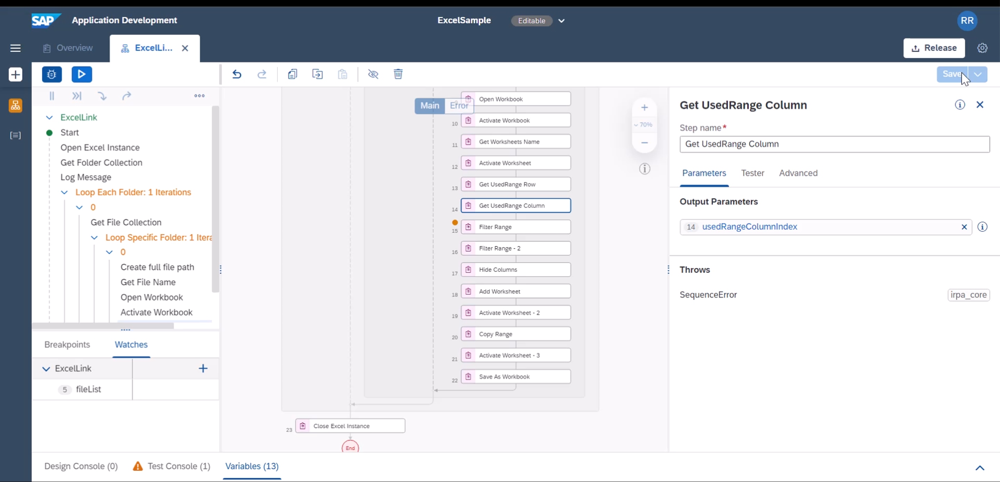
J11. We will now use a custom script activity to calculate complete range. | 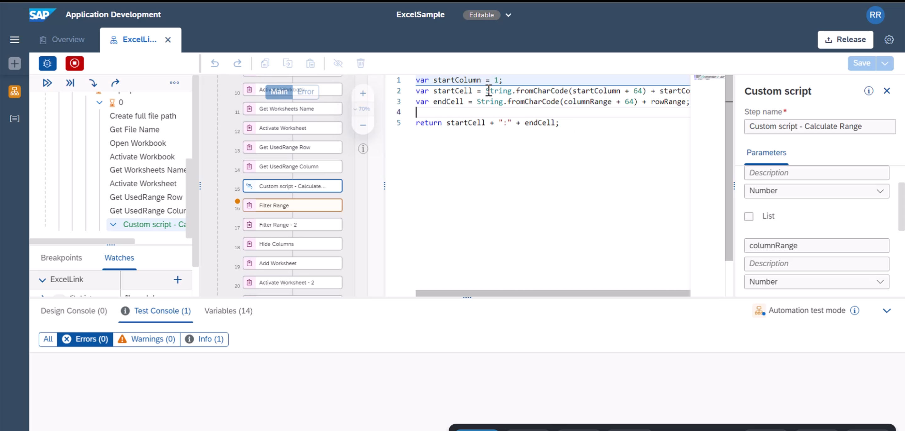

````
var startColumn = 1;

var startCell = String.fromCharCode(startColumn + 64) + startColumn;

var endCell = String.fromCharCode(columnRange + 64) + rowRange;


return startCell + ":" + endCell;
````

Instructions | Image
------------ | -----
J12. just for demonstration purpose, we will filter against first column and look for cell values containing a | 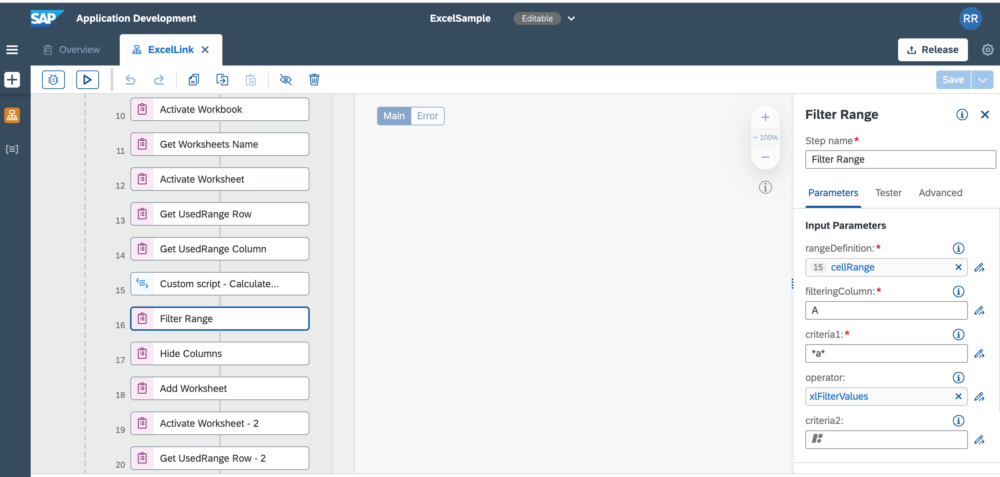
J13. We will use similar approach to find out range of values after filtering to be used with **Copy Range** | 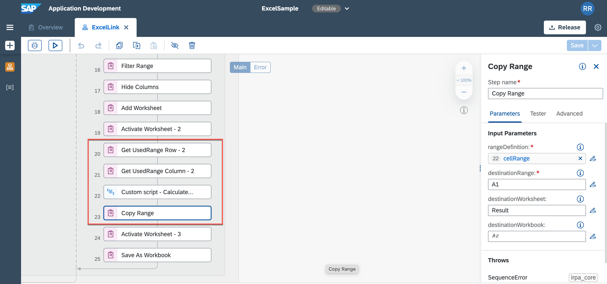
J14. We will apprend "\_new" to the new csv file name in **Save As Workbook** | 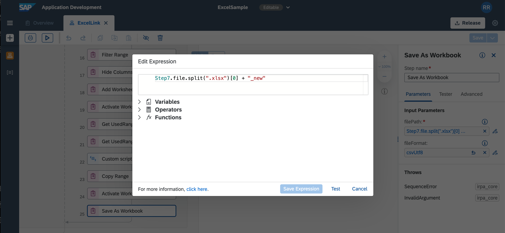
J15. Like Outlook sample, you need to release the package and publish to the library. You can do so either from the SAP Process Automation Lobby or from within the project. |


**END**