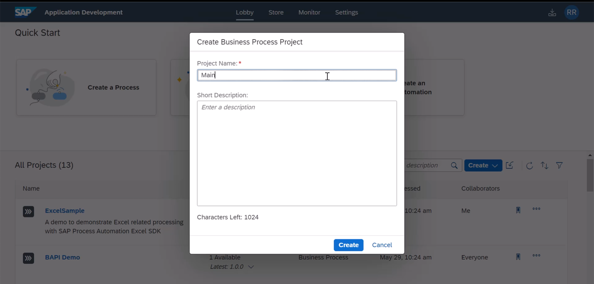
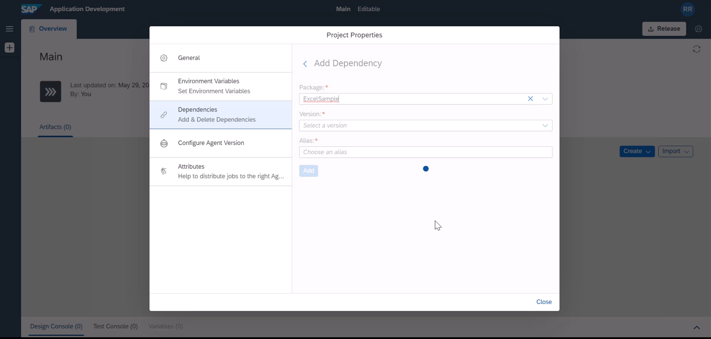
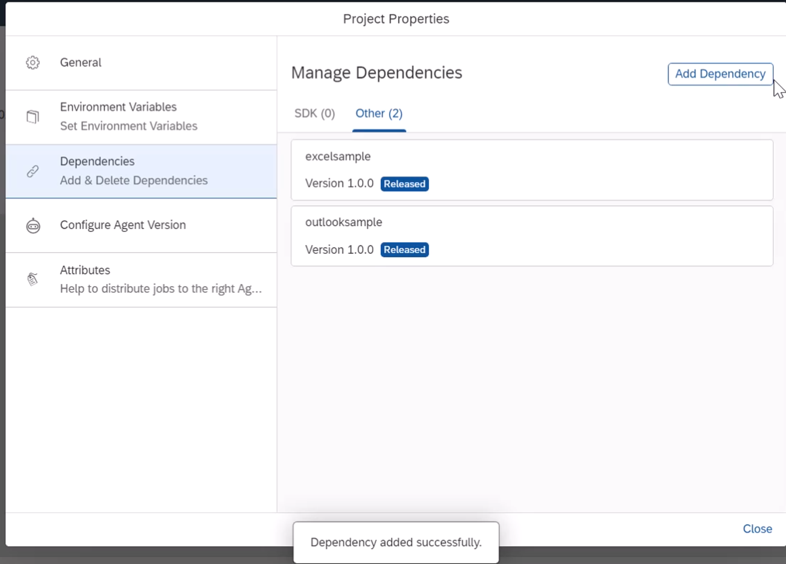
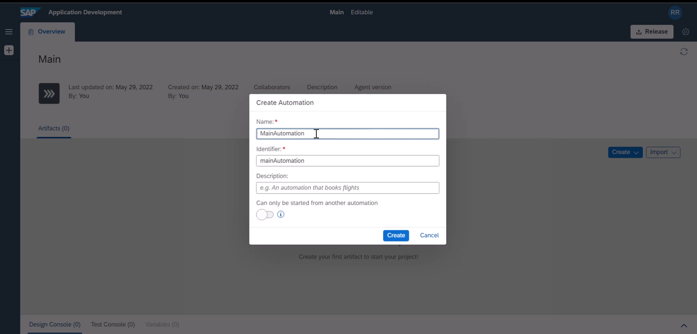
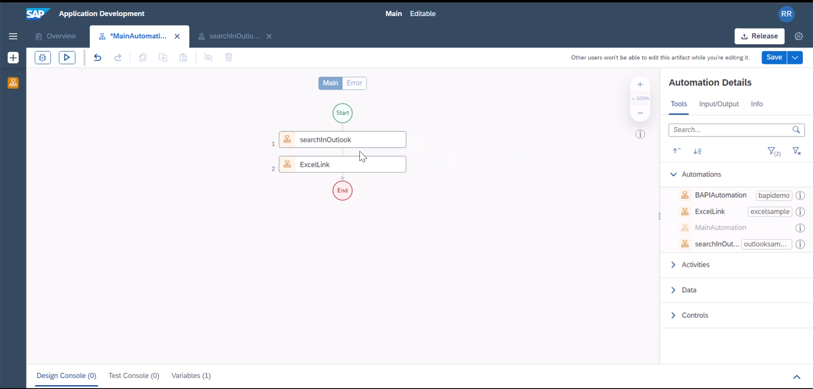

In this tutorial, we will combine the modified outlook and excel projects to single project main and embed the automations to a single automation.

Instructions | Image
------------ | -----
K1. Let us create a brand new project **Main Automation** | 
K2. Include both Excel and Outlook projects as dependency. Here I am adding Excel Project. Similarly you have to add outlook sample project | 
K3. this is the result after adding both projects as dependency | 
K4. We will call this new project as **Main Automation** project | 
K5. Add both outlook sample and excel sample projects (i named it as ExcelCloudLink) to the flow | 
K6. Save Project and test the prject to see the result by yourself |

**END**

> Like this you can create modular automations for reusability. 
