Instructions | Image
------------ | -----
L1. Create a new project called **BAPIAutomation** and include BAPI SDK as dependency | 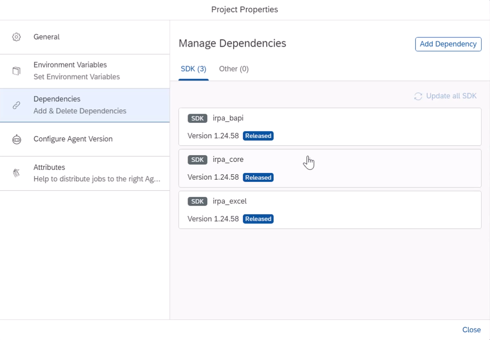
L2. Add **SET SAP Connection(SSO)** activity to the flow and provide appropriate values for the fields. In case you havent configured to use SSO, you can use Set SAP Connection (Basic) activity| 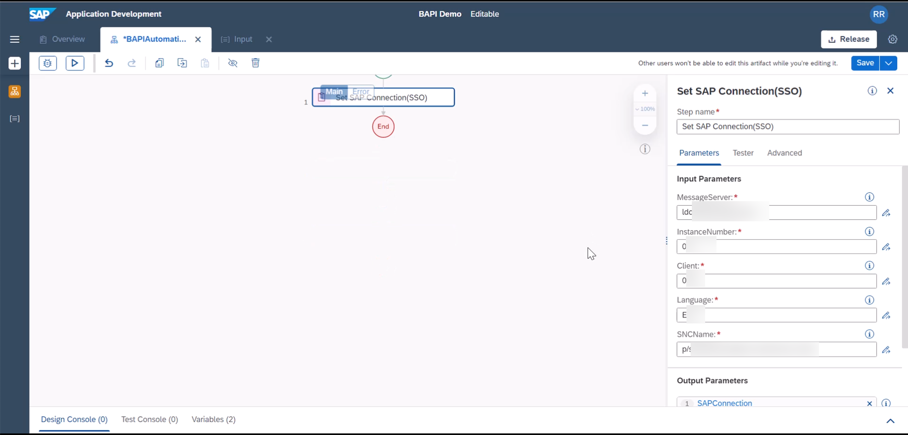
L3. Login to SAP GUI, run **se37** transaction | 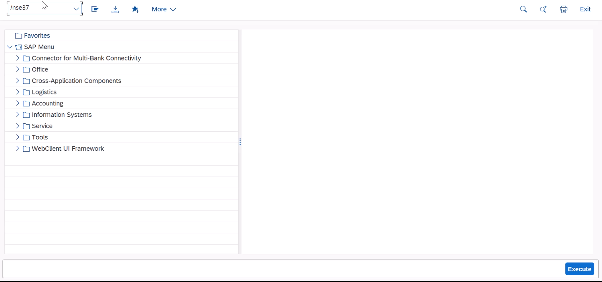
L4. Select **RFC_READ_TABLE** function module | 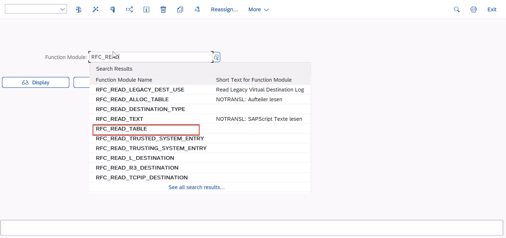
L5. Review Import options for this function module, | 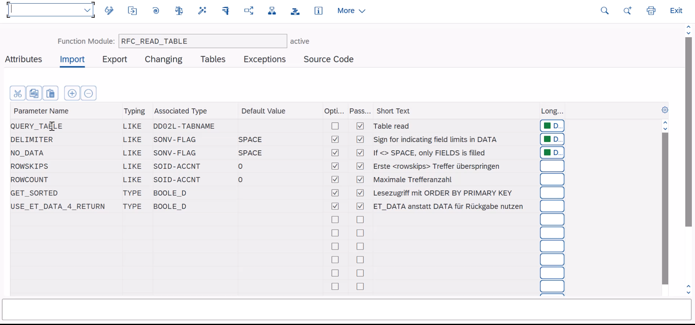
L6. This is the output we expect at the end of autoamtion | 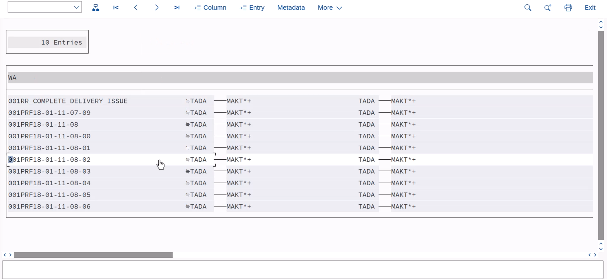
L6. Switch to Overview tab, create a new activity. Here I named it as **Input** | 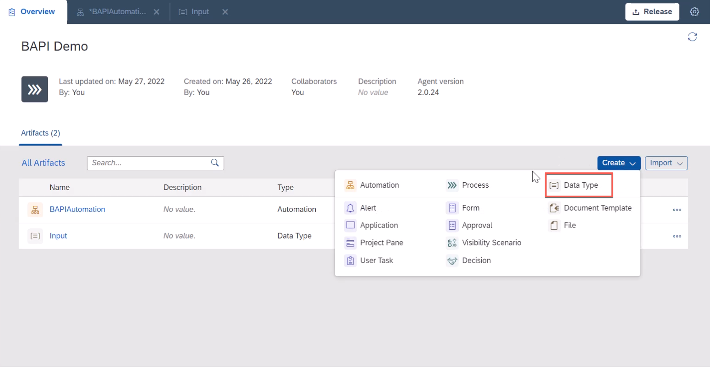
L7. Create new data types as shown in the diagram. these are the input value for the **READ_RFC_TABLE** Make sure you maintain the field types accordingly | 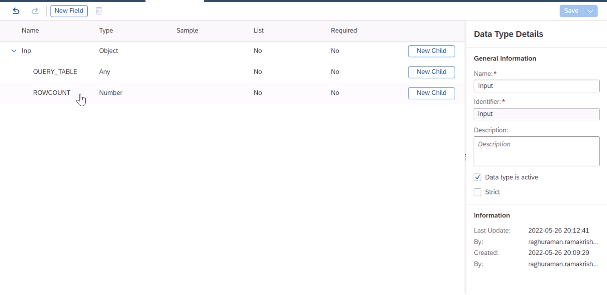
L8. Add the field type into the flow | 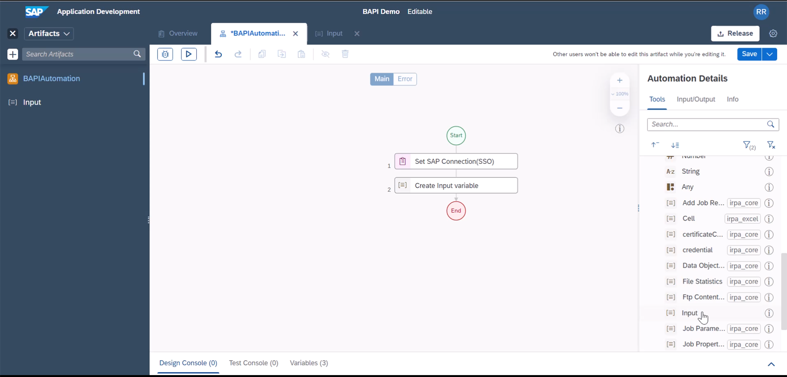
L9. Create a Custom Data of this data type | 
L10. For this exercise, we will query MAKT - Material Master related table | 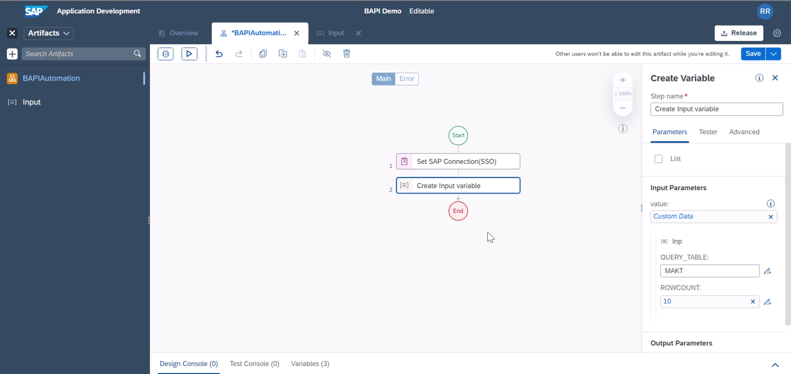
L11. Add **Execute BAPI** activity to the flow. and specify the funtio module, its input and the SAP Connection objects | 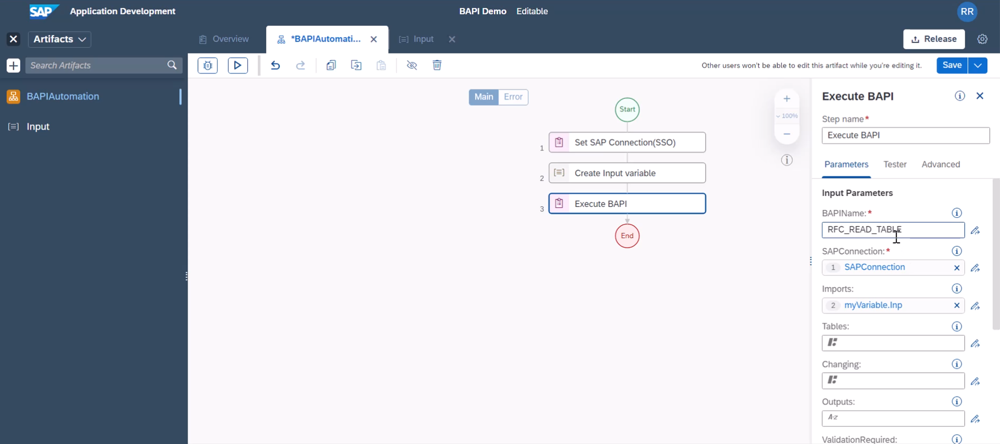
L12. Print the BAPI Response | 
L13. Close the BAPI Connection | 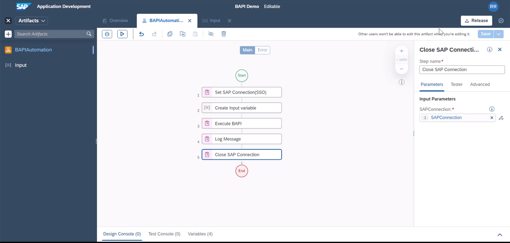
L14. You can save and execute this BAPI project and validate the response | 

**END**